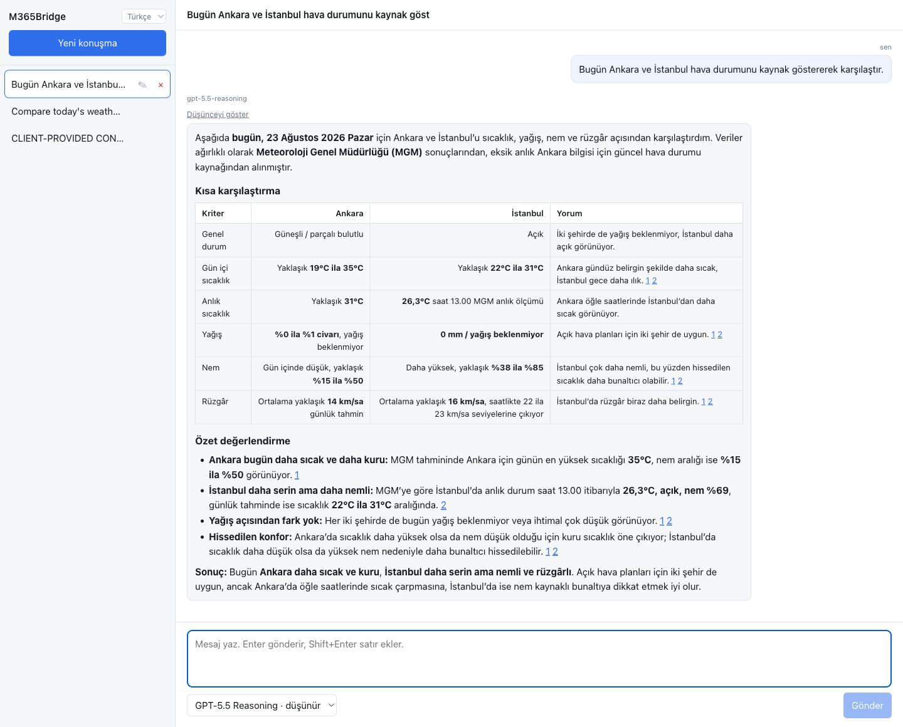

# M365Bridge

[](https://github.com/jungie1995/M365Bridge/actions/workflows/ci.yml)
[](https://github.com/jungie1995/M365Bridge)
[](go.mod)
[](#api-endpointleri)
[](#api-endpointleri)

**[English](README.md)** | **Türkçe**

M365Bridge, Microsoft 365 Copilot aboneliğinizi OpenAI ve Anthropic uyumlu bir HTTP API'ye dönüştürür. Bu iki protokolden birini konuşan her istemciyi bu servise yönlendirmeniz yeterlidir: Claude Code, Codex, Cursor, Cline, OpenAI ve Anthropic SDK'ları ya da kendi yazdığınız kod.



## Nasıl çalışır

```
İstemciniz  ->  M365Bridge  ->  substrate.office.com (SignalR)  ->  M365 Copilot
```

Copilot'un herkese açık bir API'si yok. Kendi web istemcisiyle bir SignalR WebSocket üzerinden konuşuyor. M365Bridge sizin hesabınızla oturum açar, upstream tarafta bu WebSocket protokolünü konuşur, downstream tarafta ise alıştığınız HTTP endpoint'lerini sunar. Her şey tek bir binary içinde gelir: API sunucusu, tarayıcı arayüzü, etkileşimli CLI ve kurulum sihirbazı.

## Gereksinimler

- **Microsoft 365 Copilot lisansı.** Copilot erişimi olan bir business veya enterprise hesabı. Copilot Chat (temel) hesabı da test edildi.
- [m365.cloud.microsoft](https://m365.cloud.microsoft) adresinde **oturum açmış bir tarayıcı**. Kurulum sırasında kimlik bilgilerini bir kez buradan alacaksınız.
- **Docker**, ya da kaynaktan derleyecekseniz **Go 1.26.6+**. Go 1.21 ve sonrası da çalışır: ilk derlemede 1.26.6 toolchain'ini kendisi indirir, `GOTOOLCHAIN` değeri `local` yapılmadığı sürece. Patch seviyesi gerekliliğin parçasıdır: 1.26.6 öncesi her sürüm, bu servisin kendi HTTP ve TLS yollarından ulaştığı standart kütüphane açıklarını taşır.

## Özellikler

- Streaming ve streaming olmayan metin sohbeti
- Her iki protokolde görsel girdisi, ayrıca Microsoft Designer üzerinden görsel üretimi
- Çok turlu konuşmalar; her oturum kendi M365 konuşmasına eşlenir
- Reasoning içeriği: OpenAI tarafında `reasoning_content`, Anthropic tarafında `thinking` blokları
- İstemcinin tanımladığı araçlar için tool calling; her iki protokolde, streaming ve streaming olmayan modda
- OpenAI endpoint'leri, Responses API ve compaction route'u dahil
- Anthropic endpoint'leri, kendi SSE handler'larıyla
- `/mcp` üzerinde Model Context Protocol sunucusu
- İsteğe bağlı olarak gateway'in yerelde çalıştırdığı built-in coding tools
- Her chat endpoint'inde stop sequence desteği, cevap stream edilirken uygulanır
- API key doğrulaması ve tarayıcı arayüzü için ayrı bir parola
- tiktoken BPE sayımıyla `max_tokens` uygulaması
- `/v1/quota` üzerinde konuşma kotası raporlaması
- Binary'nin içine derlenmiş tarayıcı arayüzü, İngilizce ve Türkçe
- Etkileşimli ve tek seferlik CLI modları

## Kurulum

Bu sürüm `jungie1995/M365Bridge` çatalıdır. Görev kuyruğu, tarayıcıyla yeniden bağlantı ve görsel yönlendirme düzeltmeleri bu depodan derlenen binary'lerde bulunur. Güncel Windows kurulum/yükseltme adımları [İngilizce kurulum bölümünde](README.md#installation) açıklanmıştır; `scripts/install-bridge.ps1` mevcut `data/` içeriğini korur. İlk Microsoft hesap kurulumu ayrıca yapılır.

### Seçenek A: Docker

Bu çatalın kaynak kodundan imajı derleyin.

Depoyla gelen `docker-compose.yml` dosyasını kullanın:

```yaml
services:
  m365bridge:
    build: .
    image: m365bridge-fork:local
    container_name: m365bridge
    ports:
      - "8230:8000"
    volumes:
      - ./data:/app/data
    restart: unless-stopped
```

Başlatın:

```bash
git clone https://github.com/jungie1995/M365Bridge.git
cd M365Bridge
docker compose up --build -d
```

Servis `http://localhost:8230` adresinde dinler. Host portu `8230`, container portu `8000`'e eşlenir; o port doluysa eşlemenin sol tarafını değiştirin. `./data` volume'ü kimlik bilgilerinizi, yapılandırmanızı ve cache'inizi tutar, silmeyin.

Düz `docker run` tercih ederseniz:

```bash
docker build -t m365bridge-fork:local .
docker run -d \
  --name m365bridge \
  -p 8230:8000 \
  -v "$(pwd)/data:/app/data" \
  --restart unless-stopped \
  m365bridge-fork:local
```

İmajı çekmek yerine kaynak kopyasından derlemek için `docker compose up --build -d` kullanın.

### Seçenek B: Hazır binary

Bu fork için bir sürüm yayımlandıysa platformunuza uygun binary'yi [Releases](https://github.com/jungie1995/M365Bridge/releases) sayfasından indirin ve SHA256SUMS ile doğrulayın. Aksi halde kaynak koddan derleyin:

| Platform                    | Dosya                           |
|-----------------------------|---------------------------------|
| Linux amd64                 | `m365-bridge-linux-amd64`       |
| Linux arm64                 | `m365-bridge-linux-arm64`       |
| macOS Intel                 | `m365-bridge-darwin-amd64`      |
| macOS Apple Silicon         | `m365-bridge-darwin-arm64`      |
| Windows amd64               | `m365-bridge-windows-amd64.exe` |
| Windows arm64               | `m365-bridge-windows-arm64.exe` |

```bash
mkdir m365bridge && cd m365bridge
curl -L -o m365-bridge \
  https://github.com/jungie1995/M365Bridge/releases/latest/download/m365-bridge-linux-amd64
chmod +x m365-bridge
mkdir data
```

Binary bütün runtime yollarını içinde bulunduğu dizine göre çözer, yani `data/` dizinini çalıştırıldığı yerde arar. Onu her zaman `data/` dizinini içeren dizinden çalıştırın. Başka bir yerden başlatırsanız kurulum başarılı olsa bile "token bulunamadı" hatası alırsınız.

### Seçenek C: Kaynaktan derleme

```bash
git clone https://github.com/jungie1995/M365Bridge.git
cd M365Bridge
go build -o bin/m365-bridge ./cmd/cli
mkdir -p data
```

Windows'ta çıktıyı `bin\m365-bridge.exe` olarak verin. Seçenek B'deki çalışma dizini kuralı burada da geçerlidir: her komutu repo kökünden çalıştırın.

## Microsoft 365 hesabınızı bağlamak

Kurulumun tek bölümü budur. Üç kurulum seçeneği de bu bölümü aynen kullanır.

Tarayıcınızdan üç şey toplayacak, bunları tek bir JSON dosyasına yazacak ve dosyayı kurulum sihirbazına vereceksiniz. Sihirbaz her şeyi şifreler ve servisin her açılışta okuduğu yapılandırmayı yazar.

> Üçünü de toplayın. Refresh token tek başına **24 saat** sonra geçersiz olur; cookie'siz bir kurulum ertesi gün çalışmayı bırakır. "Dün çalışıyordu, bugün yine oturum açmamı istiyor" şikayetinin tek sebebi budur.

### Adım 1: Refresh token'ı alın

1. [m365.cloud.microsoft](https://m365.cloud.microsoft) adresini açın ve oturum açın.
2. **F12** ile DevTools'u açın ve **Console** sekmesine geçin.
3. Aşağıdaki kodu yapıştırıp Enter'a basın.

<details>
<summary>Console kodunu göster</summary>

```javascript
(async () => {
// 1. Get oid/tenant from the signed-in account
let oid, tenant;
for (const key of Object.keys(localStorage)) {
  if (!key.includes('active-account-filters')) continue;
  try {
    const val = JSON.parse(localStorage.getItem(key));
    if (val?.homeAccountId?.includes('.')) { [oid, tenant] = val.homeAccountId.split('.'); break; }
  } catch(e) {}
}
if (!oid) {
  const mk = Object.keys(localStorage).find(k => k.startsWith('msal.') && k.includes('|'));
  if (mk) { const p = mk.split('|')[1]; if (p?.includes('.')) [oid, tenant] = p.split('.'); }
}
if (!oid || !tenant) return 'ERROR: No signed-in account found. Log in to m365.cloud.microsoft and run this again.';

// 2. Watch every token exchange for the one this gateway uses
const targetClientID = '4765445b-32c6-49b0-83e6-1d93765276ca';
const origFetch = window.fetch;
let done;
const captured = new Promise(resolve => { done = resolve; });
window.fetch = async function(...args) {
  const resp = await origFetch.apply(this, args);
  const url = typeof args[0] === 'string' ? args[0] : args[0]?.url || '';
  if (url.includes('oauth2/v2.0/token')) {
    try {
      let bodyStr = '';
      const init = args[1];
      if (typeof init?.body === 'string') bodyStr = init.body;
      else if (init?.body instanceof URLSearchParams) bodyStr = init.body.toString();
      else if (init?.body instanceof ArrayBuffer || ArrayBuffer.isView(init?.body)) bodyStr = new TextDecoder().decode(init.body);
      else if (args[0] instanceof Request) bodyStr = await args[0].clone().text();
      // The sign-in exchange puts a broker id in client_id and carries the real
      // target in brk_client_id, so both are accepted.
      const params = new URLSearchParams(bodyStr);
      const isTarget = params.get('client_id') === targetClientID
                    || params.get('brk_client_id') === targetClientID;
      if (isTarget) {
        const data = await resp.clone().json();
        if (data.refresh_token) {
          console.log('===== COPY THE COMPLETE JSON BELOW =====');
          console.log(JSON.stringify({oid, tenant, refresh_token: data.refresh_token}, null, 2));
          done(true);
        }
      }
    } catch(e) {}
  }
  return resp;
};

// 3. Make the app ask for a token
// The page keeps its MSAL instance out of reach of the console, so the refresh
// cannot be requested directly. Moving to another route makes the app request
// one; the original page is restored afterwards.
const startPath = location.pathname;
let moved = false;
for (const href of ['/search', '/library', '/teach', '/chat/all', '/chat']) {
  if (href === startPath) continue;
  const link = document.querySelector('a[href="' + href + '"]');
  if (link) { link.click(); moved = true; break; }
}

// 4. Wait for the exchange, then put everything back
const ok = await Promise.race([captured, new Promise(r => setTimeout(() => r(false), 20000))]);
if (moved) history.back();
window.fetch = origFetch;

return ok
  ? 'Done. Copy the JSON printed above.'
  : 'No token exchange seen; the app is still using a token it refreshed a moment ago. Reload the page and run this again.';
})()
```

</details>

Kod, uygulamanın token istemesini sağlamak için kendiliğinden başka bir sayfaya gidip geri döner. Birkaç saniye bekleyin ve şu satırın çıkmasını izleyin:

```
===== COPY THE COMPLETE JSON BELOW =====
```

Altında yazan JSON'u kopyalayın. Şuna benzer:

```json
{
  "oid": "sizin-oid-degeriniz",
  "tenant": "sizin-tenant-degeriniz",
  "refresh_token": "sizin-refresh-token-degeriniz"
}
```

Kod "token exchange görülmedi" derse, uygulama az önce yenilediği bir token'ı kullanıyor demektir. Sayfayı yenileyip kodu tekrar çalıştırın.

### Adım 2: Login cookie'lerini alın

Bu iki cookie, 24 saatlik refresh token dolduğunda servisin kendi kendine yeniden oturum açmasını sağlar. Bunlar olmadan Adım 1'i her gün tekrarlamanız gerekir.

Console kodu bunları okuyamaz. Cookie'ler kodu çalıştırdığınız sayfaya değil `login.microsoftonline.com` alan adına aittir ve `HttpOnly` işaretlidir; yani hiçbir sayfadaki hiçbir script onlara erişemez. Elle kopyalayın:

1. Aynı tarayıcıda [login.microsoftonline.com](https://login.microsoftonline.com) adresini açın.
2. **F12** ile DevTools'u açın, **Application** > **Cookies** > `https://login.microsoftonline.com` yolunu izleyin.
3. Şu iki cookie'nin değerini kopyalayın:
   - `ESTSAUTH`
   - `ESTSAUTHPERSISTENT`

### Adım 3: M365 web cookie'lerini alın

Bunlar tarayıcı arayüzündeki konuşma listesini, yeniden adlandırma ve silme işlemlerini besler. Sohbet bunlar olmadan da çalışır; sidebar yalnızca yerel oturumlara düşer ve bunu size söyler.

1. [m365.cloud.microsoft](https://m365.cloud.microsoft) adresini açın.
2. **F12** ile DevTools'u açın, **Application** > **Cookies** > `https://m365.cloud.microsoft` yolunu izleyin.
3. Orada listelenen bütün cookie'leri kopyalayın. Servis bunları tek bir `Cookie` header'ı olarak geri gönderir, bu yüzden hepsini almak hem en kolay hem en güvenilir yoldur.

### Adım 4: data/setup.json dosyasını yazın

Kurulumunuzun kullandığı `data/` dizininin içine `setup.json` dosyasını oluşturun. Docker'da bu, compose dosyasının mount ettiği dizindir.

```json
{
  "oid": "sizin-oid-degeriniz",
  "tenant": "sizin-tenant-degeriniz",
  "refresh_token": "sizin-refresh-token-degeriniz",
  "sso_cookies": [
    {"name": "ESTSAUTH", "value": "...", "domain": "login.microsoftonline.com"},
    {"name": "ESTSAUTHPERSISTENT", "value": "...", "domain": "login.microsoftonline.com"},
    {"name": "birinci-m365-cookie", "value": "...", "domain": "m365.cloud.microsoft"},
    {"name": "ikinci-m365-cookie", "value": "...", "domain": "m365.cloud.microsoft"}
  ]
}
```

**Her cookie kaydına `domain` alanını yazın.** Sihirbaz her cookie'yi bu alana bakarak ayırır: `login.microsoftonline.com` oturum açma kimlik bilgisi olur, `m365.cloud.microsoft` web istemcisi kimlik bilgisi olur. `domain` alanı olmayan bir cookie iki gruba da girmez ve atılır. Sihirbaz kaç cookie okuduğunu yine de yazdırdığı için, bu alanı unutan bir dosya çalışmış gibi görünür ve 24 saat sonra ölen bir kurulum bırakır.

### Adım 5: Kurulum sihirbazını çalıştırın

**Docker:**

```bash
docker exec -it m365bridge ./bin/m365-bridge setup-wizard
```

**Binary, Linux ve macOS:**

```bash
./m365-bridge setup-wizard
```

**Binary, Windows PowerShell:**

```powershell
.\m365-bridge.exe setup-wizard
```

Sihirbaz önce tarayıcı adımlarını hatırlatma amacıyla tekrar yazdırır, sonra `data/setup.json` dosyasını okur, refresh token'ı ve iki cookie kümesini AES-256-GCM ile şifreler, refresh token'ı Microsoft'a karşı bozdurur ve `data/.env` dosyasını yazar.

Doğrulama bu bozdurma işlemidir. Token, Microsoft cevap verene kadar kendi dosyasında bekletilir; böylece bozdurulamayan bir değer, çalışan bir token'ın üzerine yazmaz. 100 karakterden kısa bir refresh token hiçbir şey saklanmadan reddedilir: o, gerçek değerin yerinde kalmış örnek metindir.

`tenant` ve `oid` de hiçbir şey saklanmadan denetlenir. GUID olmayan bir değer ve her hanesi aynı karakter olan bir GUID (örneğin `22222222-2222-2222-2222-222222222222`) alan adı söylenerek reddedilir; Entra böyle bir id vermez, bu biçimdeki bir değer gerçeğinin yerine yazılmış doldurma metnidir. Sonrasında `data/.env` dosyasına yazılan da dosyadaki değer değildir: id'ler Microsoft'un az önce döndürdüğü access token'ın claim'lerinden okunur. `oid` token exchange'e girmediği için alabileceği tek denetim budur; yanlış bir `oid` aksi halde kurulumu çok sonra, sıradan bir sohbet isteğinde bozar.

Yalnızca çıkış koduna değil, çıktısına da bakın. Üç kimlik bilgisiyle yapılan başarılı bir çalıştırma şu üç satırı da yazdırır:

```
SSO cookies encrypted and saved
M365 web cookies encrypted and saved
Refresh token redeemed, encrypted and saved
```

Sihirbaz cookie'leri okuduğunu söylediği hâlde ilk iki satır çıkmıyorsa, `domain` alanlarınız eksik ya da yanlış yazılmıştır. `data/setup.json` dosyasını düzeltip sihirbazı tekrar çalıştırın.

JSON'u başka bir yoldan okutmak için `--file` verin:

```bash
./m365-bridge setup-wizard --file /baska/bir/yol/setup.json
```

### Adım 6: Servisi başlatın ve doğrulayın

Docker kullanıyorsanız servis zaten çalışıyor. Yeni yapılandırmayı alması için container'ı yeniden başlatın:

```bash
docker compose restart
```

Binary kurulumunda sunucuyu başlatın:

```bash
./m365-bridge serve --port 8000
```

Ardından bir soru sorun:

```bash
curl http://localhost:8230/v1/chat/completions \
  -H "Content-Type: application/json" \
  -d '{"model":"gpt5.5","messages":[{"role":"user","content":"Merhaba"}]}'
```

Kurulumunuzun dinlediği portu kullanın: yukarıdaki Docker kurulumu için `8230`, ya da `--port` ile verdiğiniz değer. Aynı adresi tarayıcıda açarsanız arayüze ulaşırsınız.

### Bağlantıyı ayakta tutmak

Microsoft, single-page application refresh token'larını **24 saatlik** ömürle verir. Bundan sonra ne olacağı topladığınız kimlik bilgilerine bağlıdır:

| Verdikleriniz | Sonuç |
|---|---|
| Yalnızca refresh token | 24 saat sonra durur. Her gün Adım 1, 4 ve 5'i tekrarlarsınız. |
| Refresh token ve login cookie'leri | Servis sessizce yeniden oturum açar. Haftalarca çalışır. |

Login cookie'leri de bir gün dolar; tenant politikası veya parola değişikliği bunu erkene çeker. Servis yeniden kimlik doğrulama hatası vermeye başladığında Adım 1'den 5'e kadar olan adımları tekrarlayın. Başka hiçbir şeyi sıfırlamanız gerekmez.

### Bir şeyler ters giderse

| Belirti | Sebep |
|---|---|
| Sihirbaz `refresh_token` eksik veya geçersiz diyor | `data/setup.json` yok, boş, ya da gerçek JSON yerine örnek metni içeriyor. |
| Sihirbaz `refresh_token` gerçek bir token olamayacak kadar kısa diyor | `data/setup.json` içinde hâlâ örnek değer duruyor. Gerçeği binlerce karakterdir. |
| Sihirbaz `tenant` ya da `oid` GUID değil veya doldurma metni diyor | `data/setup.json` içindeki o alan, tarayıcı console'unun yazdırdığı değerle hiç değiştirilmemiş. |
| Her istek `upstream_auth_failed` dönüyor ve logda `AADSTS90002: Tenant not found` yazıyor | `data/.env` içinde placeholder bir tenant var. Gerçek değerler `data/tokens/token_cache.json` içindeki token'ın `tid` ve `oid` claim'lerinde durur. |
| Sihirbaz cookie okuduğunu söylüyor ama hiçbirini kaydetmiyor | Cookie kayıtlarında `domain` alanı yok. Adım 4'e bakın. |
| Sunucu token refresh hatasıyla kapanıyor | Refresh token doldu ve kullanılabilir login cookie'si yok. Adım 1'den 5'e tekrarlayın. |
| Kurulum başarılı olduğu hâlde sunucu token bulamıyor | Sunucuyu başka bir dizinden başlattınız. `data/` dizininin bulunduğu yerden çalıştırın. |
| Sidebar'da konuşma adları görünmüyor | M365 web cookie'leri eksik veya doldu. Adım 3'ü tekrarlayın. |
| Sunucu `M365_TENANT_ID` yok diyerek kapanıyor | Sihirbaz `data/.env` dosyasını hiç yazmamış, yani son adımından önce durmuş. |

## Kullanım

### Komut satırı

```bash
# Tek soru, tek cevap
./m365-bridge "sorunuz"

# Etkileşimli oturum
./m365-bridge -i

# Model seçmek
./m365-bridge --model gpt5.5-reasoning "sorunuz"

# Cevabı stream etmeden, tek seferde yazdırmak
./m365-bridge --no-stream "sorunuz"

# Bu sürümün sunduğu modelleri listelemek
./m365-bridge --list-models

# HTTP sunucusunu başlatmak
./m365-bridge serve --port 8000
```

Bütün flag'ler isteğe bağlıdır. Hiçbiri verilmezse `serve` 8000 portunu dinler, `setup-wizard` ise `data/setup.json` dosyasını okur.

| Flag            | Tip    | Varsayılan | Açıklama                                                     |
|-----------------|--------|------------|--------------------------------------------------------------|
| `-i`            | bool   | false      | Etkileşimli mod, çok turlu                                   |
| `--model`       | string | `auto`     | Model key'i; bkz. [Modeller](#modeller)                      |
| `--reasoning`   | bool   | false      | Reasoning varyantını kullan                                  |
| `--no-stream`   | bool   | false      | Cevabın tamamını tek seferde yazdır                          |
| `--list-models` | bool   | false      | Modelleri listele ve çık                                     |
| `--version`     | bool   | false      | Sürümü yazdır ve çık                                         |
| `--help`        | bool   | false      | Bütün flag'leri ve ortam değişkenlerini yazdır, sonra çık    |

Komut satırında artan metin sorunun kendisidir.

`serve` alt komutu `--port` (varsayılan `8000`) ve `--version` alır. `setup-wizard` alt komutu `--file` (varsayılan `data/setup.json`) alır.

### HTTP

```bash
# API key yapılandırılmamışken
curl http://127.0.0.1:8000/v1/chat/completions \
  -H "Content-Type: application/json" \
  -d '{"model":"auto","messages":[{"role":"user","content":"Merhaba"}]}'

# API key ile
curl http://127.0.0.1:8000/v1/chat/completions \
  -H "Content-Type: application/json" \
  -H "Authorization: Bearer api-key-degeriniz" \
  -d '{"model":"gpt5.5","messages":[{"role":"user","content":"Merhaba"}]}'

# Streaming, adlandırılmış bir oturumla
curl http://127.0.0.1:8000/v1/chat/completions \
  -H "Content-Type: application/json" \
  -H "Authorization: Bearer api-key-degeriniz" \
  -H "X-Session-Id: oturumum-1" \
  -d '{"model":"gpt5.5","stream":true,"messages":[{"role":"user","content":"Merhaba"}]}'
```

### Python, OpenAI SDK

```python
from openai import OpenAI

client = OpenAI(
    base_url="http://127.0.0.1:8000/v1",
    api_key="api-key-degeriniz",  # yalnızca M365_API_KEYS ayarlıysa gerekir
)
resp = client.chat.completions.create(
    model="gpt5.5",
    messages=[{"role": "user", "content": "Merhaba"}],
)
print(resp.choices[0].message.content)
```

### Python, Anthropic SDK

```python
from anthropic import Anthropic

client = Anthropic(
    base_url="http://127.0.0.1:8000",
    api_key="api-key-degeriniz",
)
resp = client.messages.create(
    model="gpt5.5",
    max_tokens=1024,
    messages=[{"role": "user", "content": "Merhaba"}],
)
print(resp.content[0].text)
```

Anthropic SDK'sı `/v1/messages` yolunu kendisi ekler, bu yüzden base URL host'ta biter.

### Görsel göndermek

```python
from openai import OpenAI
import base64

client = OpenAI(base_url="http://127.0.0.1:8000/v1", api_key="api-key-degeriniz")

with open("gorsel.png", "rb") as f:
    img_b64 = base64.b64encode(f.read()).decode()

resp = client.chat.completions.create(
    model="gpt5.5",
    messages=[{
        "role": "user",
        "content": [
            {"type": "text", "text": "Bu görselde ne var?"},
            {"type": "image_url", "image_url": {"url": f"data:image/png;base64,{img_b64}"}},
        ],
    }],
)
print(resp.choices[0].message.content)
```

### İlk istekte ne olur

1. Sunucu, içinde bulunduğu dizinden `data/.env` dosyasını okur.
2. Şifrelenmiş refresh token'ı `data/tokens/rt_90day.txt` dosyasından yükler.
3. Bu token'ı bir access token ile takas eder; bu bir iki saniye sürer.
4. `Starting API server on port 8000 (no API key required)` yazar, ya da key ayarlıysa `(API key required, N key(s) configured)` yazar.
5. İlk chat isteği diğerlerinden biraz uzun sürer, çünkü `substrate.office.com` adresine WebSocket bağlantısını o anda açar.

Refresh token yoksa veya dolmuşsa, sunucu `data/tokens/sso_cookies.json` içindeki login cookie'lerini dener. Onlar da yoksa token refresh hatasıyla durur; bu durumda kurulum adımlarını tekrarlayın.

## Yapılandırma

Yapılandırma `data/.env` dosyasından okunur. Process ortamında tanımlı bir değişken dosyadakini ezer. `m365-bridge --help` bütün değişkenleri güncel varsayılanlarıyla yazdırır.

İlk ikisini kurulum sihirbazı yazar.

| Değişken         | Varsayılan                             | Açıklama                                                                        |
|------------------|----------------------------------------|----------------------------------------------------------------------------------|
| `M365_TENANT_ID` | zorunlu                                | Directory (tenant) ID. Servis bu olmadan kapanır.                               |
| `M365_USER_OID`  | zorunlu                                | Oturum açmış kullanıcının Object ID'si. Servis bu olmadan kapanır.              |
| `M365_CLIENT_ID` | `4765445b-32c6-49b0-83e6-1d93765276ca` | Access token'ların verildiği OAuth client'ı. Yalnızca varsayılanı engelleyen bir tenant için değiştirin. |
| `M365_API_KEYS`  | tanımsız                               | İstemcinin sunması gereken, virgülle ayrılmış key'ler. Tanımsızken her `/v1/*` route'u ve `/mcp` açıktır. |
| `M365_API_KEY`   | tanımsız                               | Tek bir key; yalnızca `M365_API_KEYS` tanımsızken okunur.                       |
| `TZ`             | sistem saat dilimi                     | Her turla gönderilen saat dilimi. Yoksa `/etc/localtime`, o da yoksa UTC.       |

Kalan değişkenler, etkiledikleri davranışı anlatan bölümlerde belgelenmiştir: [tarayıcı arayüzü](#tarayıcı-arayüzü), [bildirilen context window](#bildirilen-context-window), [tool loop'ları](#tool-loopunu-istemci-yürüttüğünde), [built-in coding tools](#built-in-coding-tools-opt-in) ve [görsel üretimi](#görsel-üretimi).

## Tarayıcı arayüzü

Sunucunun kök adresini bir tarayıcıda açın; yukarıdaki Docker kurulumunda bu `http://localhost:8230/` olur. Arayüz binary'nin içine derlenmiştir, yani sunulacak ayrı bir asset dizini ve çalıştırılacak ikinci bir process yoktur.

Sol tarafta konuşmalarınızı listeler, cevapları geldikçe stream eder ve `GET /v1/models` listesinden model seçmenize izin verir. Konuşma oluşturabilir, adını değiştirebilir ve silebilirsiniz. Cevaplar markdown olarak render edilir, böylece bir karşılaştırma tablosu tablo olarak gelir ve kaynak, cümlenin ortasında çıplak bir URL yerine bağlantı olur. **Düşünceyi göster** düğmesinin arkasındaki reasoning bloğu da aynı şekilde render edilir, çünkü backend onu da markdown olarak yazar. Sizin yazdığınız mesajlar aynen yazdığınız gibi gösterilir. Yeniden adlandırma ve silme, tarayıcının kendi diyalog kutuları yerine sayfa içinde sorulur.

Sayfanın ihtiyaç duyduğu her şey içine derlenmiştir. Hiçbir font, script veya stylesheet'i başka bir yerden yüklemez; bu yüzden M365 backend'i dışında internete çıkışı olmayan bir makinede de çalışır.

### Adresler

Her konuşmanın kendi adresi vardır: `/c/{oturum id}`. Bir konuşmayı açmak o adresi yazar, böylece sayfayı yenileyerek geri dönebilir, adresi paylaşabilir ve tarayıcının ileri geri düğmeleriyle gezinebilirsiniz. Gateway'in artık tutmadığı bir konuşmayı gösteren adres boş panele düşer.

### Sidebar neyi gösterir

İki kaynak birleştirilir. `GET /v1/conversations` konuşma adlarını verir ve Adım 3'teki M365 web cookie'lerini gerektirir. `GET /v1/sessions` ise konuşmayı devam ettirilebilir kılan oturum id'lerini verir. İkisinde birden bulunan bir konuşma tek satır olarak görünür.

Cookie'ler yoksa ilk çağrı başarısız olur, sidebar yalnızca yerel eşlemelere düşer ve bunu söyler. Yalnızca M365'in bildiği bir konuşma işaretlenir ve siz onu açtığınız anda ona bir oturum id'si bağlanır. M365 web veya mobil istemcisinde başlattığınız bir konuşmayı burada devam ettirebilmenizi sağlayan şey budur.

### Dil

Arayüz İngilizce ve Türkçe gelir. Seçici sidebar'da adın yanındadır ve varsayılan dil İngilizcedir.

Her dil, `web/src/locales` altında dil koduyla adlandırılmış tek bir JSON dosyasıdır. Kodun hiçbir yeri bir dosya adı bilmez; derleme bütün dizini içeri alır. Dil eklemek için `en.json` dosyasını kopyalayın, değerlerini çevirin, `de.json` gibi bir adla kaydedin ve `make ui` çalıştırın. `$label` girdisi dilin kendi dilindeki adıdır ve seçicide görünen budur. Katalogun yalnızca bir kısmını çeviren bir dosya, kalanı için İngilizceye düşer; yani eksik bir çeviri bozuk değil, kullanılabilir olur.

Seçim `m365bridge_lang` cookie'sinde saklanır. Cookie'si olmayan bir tarayıcı ile bu sürümde bulunmayan bir dili gösteren cookie aynı şekilde ele alınır: İngilizce seçilir ve cookie'ye geri yazılır, böylece saklanan değerle gösterilen dil çelişemez.

### Transcript'ler

Backend geçmişi conversation ID ile takip eder ve asla geri göndermez. Bu yüzden gateway taşıdığı turların kendi kaydını tutar: `data/transcripts` altında oturum başına bir dosya. Mesaj içeriğinin diske ulaştığı tek yer burasıdır. Oturum başına kayıt sayısı, mesaj başına bayt ve depodaki dosya sayısı sınırlıdır.

Bu gateway dışında başlamış bir konuşmanın kaydı yoktur, dolayısıyla açtığınızda geçmişi boş görünür. Arayüz bunu söyler ve geçmişi getirmeyi önerir; bu `GET /v1/conversations/{id}/messages` çağrısıdır. Bir oturumu silmek transcript'ini de siler; hiçbir şey üretmeyen bir tur da siler, çünkü ikisi de o id altında yeni bir konuşma başlatır.

### Ayarlar

| Değişken               | Varsayılan | Açıklama                                                                                          |
|------------------------|------------|----------------------------------------------------------------------------------------------------|
| `M365_ENABLE_WEB_UI`   | `1`        | Arayüzü `/` üzerinde sunar ve transcript kaydeder. `0`, `false`, `off` veya `no` ikisini de kapatır. |
| `M365_WEB_UI_PASSWORD` | tanımsız   | Arayüzün sorduğu parola. Tanımsızken arayüz erişebilen herkese açıktır.                            |

Arayüzü kapatmak `/` adresini 404'e çevirir ve kaydı durdurur; yalnızca proxy görevi gören bir kurulumun istediği budur. Bu durumda `GET /v1/sessions/{id}/messages` çağrısı `404 transcripts_disabled` yanıtı verir.

### Parola

`M365_WEB_UI_PASSWORD` değerini ayarlarsanız arayüz hiçbir şey çizmeden önce onu sorar. Tanımsız bırakırsanız arayüz girişsiz açılır.

Parola, gateway'in kabul ettiği bir kimlik bilgisidir; kendine ait bir session değildir. Tarayıcı onu bir cookie'de tutar ve bir API istemcisinin key'ini gönderdiği `Authorization` header'ı ile gönderir. Böylece her kimlik bilgisi bir header üzerinde kalır, cross-site bir form onu taşıyamaz ve arayüz, kendi CSRF korumasını gerektirecek bir session mekanizması olmadan korumalı route'lara ulaşır.

Sayfanın kendisi kimlik bilgisi olmadan sunulduğu için, arayüzün ne soracağını öğrenebilmesini sağlayan iki public route vardır:

| Endpoint               | Açıklama                                                                    |
|------------------------|------------------------------------------------------------------------------|
| `GET /v1/auth`         | Arayüzün ne isteyeceğini bildirir: `{"mode": "none" \| "password" \| "api_key"}` |
| `POST /v1/auth/verify` | İstek header'ındaki kimlik bilgisinin kabul edilip edilmediğini söyler       |

İkisi de bir secret döndürmez. Kimlik bilgisi gövdede değil header'da taşındığı için payload kaydeden hiçbir yere düşmez; log yalnızca bir kimlik bilgisinin reddedildiğini kaydeder.

`M365_WEB_UI_PASSWORD` ve `M365_API_KEYS` birbirinden bağımsız iki ayardır:

- **İkisi de tanımsız**: arayüz girişsiz açılır, her route açıktır.
- **Yalnızca parola**: arayüz parolayı sorar. API açık kalır, çünkü boş bir key listesi bu gateway'in her yerinde "açık" anlamına gelir. API de kapalı olacaksa `M365_API_KEYS` değerini de ayarlayın.
- **Yalnızca key**: arayüz API key sorar, çünkü key olmadan yaptığı her veri çağrısı reddedilir.
- **İkisi de**: arayüz parolayı sorar, API ise parolayı da key'i de kabul eder.

### Arayüzü yeniden derlemek

Kaynaklar `web/` altındadır ve derleme çıktısı `pkg/webui/dist` içinde commit'lenir, çünkü `go:embed` onu derleme anında okur. `web/` altında bir şey değiştirdikten sonra:

```bash
make ui      # node container'ında derler ve çıktıyı pkg/webui/dist içine kopyalar
make up      # imajı yeniden derler ve container'ı yeniden başlatır
```

Hızlı iterasyon için Vite dev server'ını kullanın. Arayüzü kendisi sunar ve `/v1` isteklerini `http://localhost:8230` adresindeki gateway'e yönlendirir:

```bash
cd web && npm install && npm run dev
```

İşiniz bittiğinde `make ui` çalıştırın, böylece commit'lenen derleme kaynaklarla eşleşir.

Arayüz React kullanır; cevaplar için `remark-gfm` ile birlikte `react-markdown`, diyaloglar için SweetAlert2. Hepsi commit'lenen çıktıya paketlenmiştir, bu yüzden sunulan sayfa çalışma anında hiçbir şey indirmez.

## Oturumlar ve konuşmalar

Her oturum tek bir M365 konuşmasına eşlenir. Oturum id'si şu sırayla çözülür:

1. Model adında iki nokta üst üsteden sonraki kısım: `model:oturumID`
2. İstek gövdesindeki `previous_response_id`, yalnızca `/v1/responses` için
3. İstek gövdesindeki `session_id`
4. İstek gövdesindeki `user`
5. `X-Session-Id` header'ı
6. `X-Claude-Code-Session-Id` header'ı (Claude Code) veya `session-id` (Codex)
7. Auth açıkken `hash(api_key + ilk kullanıcı mesajı)`, kapalıyken `hash(ilk kullanıcı mesajı)`

Her endpoint bu tek sırayı kullanır.

Claude Code ve Codex, bir oturumun her isteğine kendi oturum bilgisini yazar; kullandıkları header adı ikisinde de değiştirilemez. 6. kural bu iki adı okur, böylece iki istemci de hiçbir yapılandırma olmadan oturum başına tek konuşma tutar. Üstündeki kuralların altında yer alır, çünkü istemci o header'ı kendiliğinden yazarken üstündeki her değeri çağıran bilerek koyar.

Codex ayrıca `session-id` ile aynı değeri taşıyan bir `thread-id` header'ı gönderir; onu okumak yalnızca zaten `session-id` taşıyan bir istek için işe yarardı. `x-codex-turn-metadata` header'ı ise hiç okunmaz: içindeki `installation_id` bir makinedeki bütün oturumlarda aynı kalır, dolayısıyla konuşmayı ona bağlamak ilgisiz oturumları tek konuşmada birleştirirdi.

Hash yedeği, ilk kullanıcı mesajları farklı olduğu sürece diğer bütün istemcileri kapsar.

### Oturumu model adında vermek

Oturum id'sini model adının içine iki nokta üst üste ile gömebilirsiniz:

```
model: "gpt5.5-reasoning:oturumum-001"
```

Bu, `X-Session-Id: oturumum-001` header'ını ya da gövdedeki `session_id` alanını göndermekle aynı işi yapar. Model key'i iki noktadan önce, oturum id'si sonra okunur. Claude Code ve Codex zaten 6. kural kapsamındadır; bu yolu oturumu kendiniz adlandırmak istediğinizde ya da hiç oturum header'ı göndermeyen bir istemci için kullanın.

### Oturumları yönetmek

`GET /v1/sessions` eşlemeleri en yeniden eskiye listeler. Eşlemenin kendi oturum id'sini taşımaya başlamasından önce yazılmış kayıtlar listelenemez, çünkü cache dosyasının adı anahtarın hash'idir. Bunlar `legacy_entries` sayısı olarak bildirilir ve bir sonraki tur onları yeniden yazdığında listeye katılır.

`DELETE /v1/sessions/{id}` önce upstream M365 konuşmasını siler, sonra eşlemeyi temizler; böylece o oturum id'siyle atılan bir sonraki tur yeni bir konuşma başlatır. Upstream silme başarısız olursa eşleme korunur ve isteği tekrarlayabilirsiniz. Konuşmayı silmek M365 web cookie'lerini gerektirir; yalnızca eşlemeyi temizleyip konuşmayı yerinde bırakmak için `?local_only=true` ekleyin. Bu cookie'leri olmayan bir kurulumun ihtiyaç duyduğu yol budur.

Silme her iki yönde de eşlenmiştir. `DELETE /v1/conversations/{id}` o konuşmaya bağlı her oturumu ve transcript'ini temizler, çünkü birden fazla oturum tek bir konuşmayı gösterebilir.

`PUT /v1/sessions/{id}` gövdesinde `{"conversation_id": "..."}` alır ve bir oturumu hâlihazırda var olan bir konuşmaya bağlar. Chat yolu bir oturumu yalnızca konuşmaya çözer, hiç ters yöne gitmez; bu route olmasa başka bir yerde başlamış bir konuşma gateway üzerinden devam ettirilemezdi. Var olan bir oturumu yeniden bağlamak serbesttir.

### Sistem talimatları

M365 backend'i konuşma geçmişini kendisi tutar ve yalnızca son turu alır. Bu yüzden daha önceki bir mesajda gönderilen talimat ona hiç ulaşmaz. İstekteki her `system` mesajı toplanır ve o turun önüne eklenir; düzleştirilmiş geçmişin dışında tutulur, aksi hâlde geçmiş bir konuşma satırı gibi okunurdu.

`developer` rolü de aynı şekilde ele alınır. OpenAI bu rolü reasoning modelleri için yeniden adlandırdı ve iki ad da geçerli kaldı, dolayısıyla hangisini gönderirseniz gönderin modele aynı şekilde ulaşır.

Anthropic'in üst seviye `system` alanı hem string hem de metin bloğu dizisi olarak kabul edilir ve aynı öne eklenmiş talimata dönüşür.

## API endpoint'leri

| Endpoint                              | Açıklama                                                       |
|---------------------------------------|-----------------------------------------------------------------|
| `POST /v1/chat/completions`           | OpenAI Chat Completions, streaming ve streaming olmayan        |
| `POST /v1/completions`                | OpenAI text completion                                          |
| `POST /v1/responses`                  | OpenAI Responses API                                            |
| `POST /v1/responses/compact`          | OpenAI Responses Compact, Codex remote compaction için         |
| `POST /v1/messages`                   | Anthropic Messages, kendi SSE handler'larıyla                   |
| `POST /v1/messages/count_tokens`      | Anthropic girdi token sayımı                                    |
| `POST /v1/complete`                   | Anthropic Complete                                              |
| `POST /v1/images/generations`         | Metinden görsel üretir                                          |
| `POST /v1/images/edits`               | Var olan bir görseli düzenler                                   |
| `GET /v1/images/{ref}`                | Chat cevabında üretilmiş bir görsel                             |
| `GET /v1/conversations`               | M365 konuşmalarını listeler; M365 web cookie'lerini gerektirir |
| `POST /v1/conversations`              | İlk mesajla birlikte konuşma oluşturur                          |
| `PATCH /v1/conversations/{id}`        | `{"name": "..."}` ile konuşmayı yeniden adlandırır             |
| `DELETE /v1/conversations/{id}`       | Konuşmayı siler ve oturum eşlemelerini temizler                |
| `GET /v1/conversations/{id}/messages` | Upstream'de duran bir konuşmanın turlarını okur                |
| `GET /v1/models`                      | Model listesi, iki wire format birden                           |
| `GET /v1/quota`                       | Son görülen M365 konuşma mesaj kotası                          |
| `GET /v1/personalization`             | Hesabın Copilot memory ayarları                                |
| `PATCH /v1/personalization`           | Hesabın Copilot memory'sini açar veya kapatır                  |
| `GET /v1/sessions`                    | Oturum-konuşma eşlemelerini listeler                            |
| `GET /v1/sessions/{id}`               | Bir oturumun conversation ID'sini okur                          |
| `PUT /v1/sessions/{id}`               | Oturumu var olan bir konuşmaya bağlar                           |
| `GET /v1/sessions/{id}/messages`      | Bir oturumun kaydedilmiş turlarını okur                         |
| `DELETE /v1/sessions/{id}`            | Konuşmayı siler ve eşlemeyi temizler                            |
| `POST /mcp`                           | Model Context Protocol sunucusu, JSON-RPC 2.0                   |
| `GET /v1/health`                      | Codex için erişilebilirlik kontrolü, auth istemez              |
| `GET /v1/auth`                        | Arayüzün ne isteyeceğini bildirir, auth istemez                |
| `POST /v1/auth/verify`                | Kimlik bilgisinin kabul edilip edilmediği, auth istemez        |
| `GET /health`                         | Sağlık kontrolü, auth istemez                                   |
| `GET /`                               | Tarayıcı arayüzü; sayfanın kendisi auth istemez                |

`GET /v1/sessions/{id}/messages` gateway'in o oturum için kaydettiklerini döndürür. `M365_ENABLE_WEB_UI` kapalıyken `404 transcripts_disabled`, başka bir yerde başlamış bir konuşma için ise boş liste verir.

`GET /v1/conversations/{id}/messages` bu gateway'in hiç taşımadığı bir konuşmanın turlarını okur. Backend geçmişi conversation ID altında tutar ve onu döndüren bir action sunmaz; bu yüzden geçmiş, M365 web istemcisinin render ettiği konuşma sayfasından çıkarılır ve bu da M365 web cookie'lerini gerektirir. Bir sayfa indirmeye ve bu projenin denetlemediği bir serialization'ı gezmeye mal olduğu için hiçbir yer onu kendiliğinden çağırmaz. Sonucu bir oturuma kaydetmek ve oturumu konuşmaya bağlamak için `?session_id=...` ekleyin; arayüzün "geçmişi yükle" düğmesinin arkasında yaptığı budur. Bu parametre olmadan yanıt döner ve hiçbir şey yazılmaz. Okunabilir tek bir tur bile taşımayan bir sayfa, boş konuşma yerine `502` yanıtı alır, çünkü çağıran taraf boş bir konuşmayı başarısız bir okumadan ayırt edemez.

## Hata yanıtları

Her endpoint hataları OpenAI hata biçiminde bildirir. `type` istemcinin dallanacağı kategoridir, `code` ise makinenin okuyacağı belirli sebeptir:

```json
{"error": {"message": "M365 rate limit reached for this chat request; retry after the interval in the Retry-After header", "type": "rate_limit_error", "code": "rate_limit_exceeded"}}
```

`type` değeri `invalid_request_error`, `authentication_error`, `rate_limit_error` veya `server_error` olur. Proxy'nin kendi başına reddettiği bir istekte `code`, `bad_request` veya `method_not_allowed` gibi durum kodunun slug'ıdır. 32 MiB'ı aşan gövde kendi adı olan tek istisnadır: `413 request_too_large`. Böylece istemci, küçültmesi gereken bir isteği bozuk bir istekten ayırt edebilir.

Başarısız bir backend isteği genel bir `500` olarak değil, sınıflandırılarak bildirilir:

| Durum  | `code`                     | Sebep                                                          |
|--------|----------------------------|-----------------------------------------------------------------|
| `401`  | `upstream_auth_failed`     | Saklanan kimlik bilgileri yok ya da yenilenemedi               |
| `403`  | `insufficient_permissions` | M365, yapılandırılmış hesap için isteği reddetti               |
| `429`  | `rate_limit_exceeded`      | M365 isteği kısıtladı; `Retry-After` header'ı gönderilir       |
| `429`  | `upstream_throttled`       | Konuşma mesaj kotası tükendi                                    |
| `409`  | `tool_round_limit`         | Bir tur `M365_MAX_TOOL_ROUNDS` değerinden fazla tool round sürdü |
| `404`  | `model_not_found`          | İstenen model `GET /v1/models` listesinde yok                  |
| `502`  | `upstream_error`           | M365 isteği reddetti ya da erişilemedi                          |
| `502`  | `upstream_unavailable`     | WebSocket handshake'i başarısız oldu ya da bağlantı düştü      |
| `502`  | `upstream_turn_failed`     | M365 turu cevap üretmeden bitirdi                               |
| `502`  | `upstream_content_blocked` | M365 cevap vermek yerine isteği geri çevirdi                    |
| `503`  | `upstream_unavailable`     | M365 kendini kullanılamaz olarak bildirdi                       |
| `504`  | `upstream_timeout`         | M365 zamanında cevap vermedi                                    |

Upstream kaynaklı olduğuna dair kanıt bulunmayan bir hata yine `500` ve `internal_error` ile bildirilir, böylece proxy'deki bir bug backend kesintisi gibi sunulmaz. Hata mesajları sabit metindir; istek URL'leri ve kimlik bilgisi dosya yolları dahil transport hatası sunucu logunda kalır.

Bir stream açıldıktan sonra durum kodu çoktan gönderilmiştir, bu yüzden aynı sınıflandırma gövdede taşınır. OpenAI biçimli route'lar data satırına bir `error` nesnesi koyar ve ardından `[DONE]` gönderir. `/v1/messages` ve `/v1/complete` bir `error` event'i, `/v1/responses` ise `response.failed` gönderir. Hiçbir route hatayı asistan içeriği olarak yazmaz; istemci onu cevap sanıp saklardı.

## Modeller

Model seçimi, M365 backend'inin okuduğu `tone` alanında taşınır. GPT-5.x key'leri GPT-5 backend'ine gider. Claude tone'ları Claude cevabı döndürür, ancak M365 SignalR metadata'sında altta çalışan modelin kimliğini açıklamaz.

| Key                        | Tone              | OpenAI ID         | Thinking | Backend |
|----------------------------|-------------------|-------------------|----------|---------|
| `auto`                     | Magic             | gpt-4-auto        | Hayır    | GPT-5   |
| `quick`                    | Chat              | gpt-4-quick       | Hayır    | GPT-5   |
| `reasoning`                | Gpt_5_2_Reasoning | gpt-4-reasoning   | Evet     | GPT-5   |
| `gpt5.2`                   | Gpt_5_2_Chat      | gpt-5.2           | Hayır    | GPT-5   |
| `gpt5.2-reasoning`         | Gpt_5_2_Reasoning | gpt-5.2-reasoning | Evet     | GPT-5   |
| `gpt5.3`                   | Gpt_5_3_Chat      | gpt-5.3           | Hayır    | GPT-5   |
| `gpt5.4`                   | Gpt_5_4_Chat      | gpt-5.4           | Hayır    | GPT-5   |
| `gpt5.4-reasoning`         | Gpt_5_4_Reasoning | gpt-5.4-reasoning | Evet     | GPT-5   |
| `gpt5.5`                   | Gpt_5_5_Chat      | gpt-5.5           | Hayır    | GPT-5   |
| `gpt5.5-reasoning`         | Gpt_5_5_Reasoning | gpt-5.5-reasoning | Evet     | GPT-5   |
| `gpt5.6-reasoning`         | Gpt_5_6_Reasoning | gpt-5.6-reasoning | Evet     | GPT-5   |
| `claude`                   | Claude_Sonnet     | claude-sonnet-4.6 | Hayır    | Claude  |
| `claude-sonnet`            | Claude_Sonnet     | claude-sonnet-4.6 | Hayır    | Claude  |
| `claude-opus`              | Claude_Opus       | claude-opus-4.6   | Evet     | Claude  |
| `claude-sonnet-4-20250514` | Claude_Sonnet     | claude-sonnet-4.6 | Hayır    | Claude  |

### Hangisini kullanmalı

| İhtiyacınız                                | Model              |
|--------------------------------------------|--------------------|
| Genel kullanım, seçimi backend yapsın      | `auto`             |
| Basit sorulara hızlı cevap                 | `quick`            |
| Karmaşık akıl yürütme, çok adımlı problem  | `gpt5.5-reasoning` |
| En yeni reasoning modeli                   | `gpt5.6-reasoning` |
| Güncel bir modelde düz sohbet              | `gpt5.5`           |
| Claude Sonnet 4.6                          | `claude-sonnet`    |
| Claude Opus 4.6, en yetenekli olan         | `claude-opus`      |

Bir reasoning modeli, cevabının yanında düşünce içeriği de üretir. OpenAI endpoint'leri bunu `reasoning_content` olarak, Anthropic endpoint'leri ise `text` bloğundan önce gelen bir `thinking` bloğu olarak sunar. `claude-opus` da üretir, `claude-sonnet` üretmez. `gpt5.6-reasoning` bu yeteneği ilan eder ama ürettiği gözlenmemiştir. İlan edilen her yetenek, tone'un adından değil ölçülen davranışından gelir.

### Bu gateway'in sunmadığı model adları

Registry dışında kalan bir model adı `404 model_not_found` ile yanıtlanır, başka bir kayda düşülmez. Böylece çağıran taraf istemediği bir tone'dan cevap almaz.

Registry, agent istemcilerinin gönderdiği üretici adlarını taşır; bu yüzden `claude-sonnet-4-20250514` çözülür. `gpt-4o` ve `o1` çözülmez, `404` döner. Sunulan bütün id'leri `GET /v1/models` listeler.

Model belirtmeyen bir istek `auto` yerine `gpt5.5-reasoning` modeline düşer; tool calling için güvenilir olan reasoning tone'u budur. Bu kural boş `model` alanını, hiç gönderilmemiş bir alanı ve tek başına `:oturum-id` ekini kapsar.

### Bildirilen context window

`GET /v1/models` içindeki her kayıt `context_window` ve `max_output_tokens` değerlerini ilan eder, böylece istemci tarafındaki harness'lar prompt'u ya da çıktıyı önceden kırpmaz. Bunlar yalnızca istemci için ipucudur; M365 kendi sınırlarını her hâlükârda uygular.

| Değişken                 | Varsayılan | Açıklama                                                       |
|--------------------------|------------|-----------------------------------------------------------------|
| `M365_CONTEXT_WINDOW`    | `1000000`  | `/v1/models` içinde ilan edilen context window token sayısı.   |
| `M365_MAX_OUTPUT_TOKENS` | `1000000`  | `/v1/models` içinde ilan edilen azami çıktı token sayısı.      |

### Model listesi alanları

`GET /v1/models` her modeli bir kez, ilan ettiği id'ye göre sıralayarak listeler; bu yüzden `claude` ve `claude-sonnet` gibi alias'lar iki kez görünmez. Her kayıt şunları taşır:

| Alan                | Açıklama                                                                                       |
|---------------------|--------------------------------------------------------------------------------------------------|
| `owned_by`          | Claude tone'ları için `anthropic-via-microsoft-365`, diğerleri için `microsoft-365`.             |
| `context_window`    | İlan edilen window; `M365_CONTEXT_WINDOW` değerinden.                                            |
| `max_output_tokens` | İlan edilen çıktı bütçesi; `M365_MAX_OUTPUT_TOKENS` değerinden.                                  |
| `max_input_tokens`  | Window eksi çıktı bütçesi; çıktı bütçesi daha küçük değilse window'un tamamı.                   |
| `supports_tools`    | Her zaman `true`; her model, simulated tool calling katmanı üzerinden çağıranın araçlarına ulaşır. |

Yanıt ayrıca `reasoning_effort_presets` taşır; her biri Responses API'nin kabul ettiği bir effort değerini adlandıran `{effort, description}` çiftidir.

Her kayıt bunlara ek olarak Codex CLI'ın okuduğu model katalog alanlarını da taşır; düz OpenAI istemcileri bunları yok sayar: `base_instructions`, `model_messages`, `default_reasoning_level`, `apply_patch_tool_type`, `shell_type`, `tool_mode`, `truncation_policy`, `supports_parallel_tool_calls` ve verbosity ile reasoning summary varsayılanları. Her yetenek hem üst seviyede hem `capabilities` altında tekrarlanır, çünkü OpenAI uyumlu istemciler bunu nerede arayacakları konusunda anlaşamıyor.

#### Tek yanıtta iki wire format

Bu route OpenAI ve Anthropic istemcilerine aynı anda cevap verir, çünkü iki protokol de proxy'ye aynı yoldan ulaşır. Her kayıt aynı anda hem geçerli bir OpenAI model nesnesi hem de geçerli bir Anthropic `ModelInfo` nesnesidir. İki alan kümesi çakışmaz, dolayısıyla her istemci yalnızca bildiğini okur.

| Alan            | Protokol  | Açıklama                                            |
|-----------------|-----------|------------------------------------------------------|
| `object`        | OpenAI    | Her zaman `model`.                                  |
| `created`       | OpenAI    | Unix saniyesi.                                      |
| `owned_by`      | OpenAI    | Tone'un arkasındaki üretici.                        |
| `shutdown_date` | OpenAI    | Her zaman `null`; kullanımdan kaldırılacak model yok. |
| `type`          | Anthropic | Her zaman `model`.                                  |
| `display_name`  | Anthropic | Okunabilir ad, örneğin `Claude Sonnet 4.6`.         |
| `created_at`    | Anthropic | `created` ile aynı an, RFC 3339 biçiminde.          |
| `max_tokens`    | Anthropic | Çıktı üst sınırı; `max_output_tokens` ile aynı.     |

Listenin kendisi OpenAI için `object` ve `data`, Anthropic için `has_more`, `first_id` ve `last_id` taşır. Registry'nin tamamı tek sayfaya sığar, dolayısıyla `has_more` her zaman `false`'tur ve cursor'lar ilan edilen ilk ve son id'dir.

`capabilities` alanı, düz OpenAI tarzı kayıtların yanında Anthropic'in yetenek ağacını tutar: `batch`, `citations`, `code_execution`, `context_management`, `effort`, `image_input`, `pdf_input`, `structured_outputs` ve `thinking`. Her düğüm bir `supported` boolean'ı taşır ve üçü bir seviye daha derinleşir: `effort` kabul edilen her değeri (`low`, `medium`, `high`, `xhigh`, `max`), `thinking` kendi `types` değerlerini (`enabled`, `adaptive`), `context_management` ise tarihli her stratejiyi adlandırır. Değerler proxy'nin gerçekte ne yaptığını söyler, bu yüzden çoğu `false` okur. `effort` yalnızca yönlendirilecek bir `-reasoning` varyantı olan model için `true`, `thinking` ise yalnızca chain-of-thought içerik ürettiği ölçülmüş bir tone için `true` olur.

Claude Code gateway modellerini bu route üzerinden keşfeder. Yalnızca Anthropic formatını okur ve yalnızca `claude` veya `anthropic` ile başlayan id'leri ekler; Claude tone'larının böyle id'ler taşımasının sebebi budur.

### Konuşma kotası

M365, konuşma başına bir mesaj üst sınırı uygular ve sayaçları update frame'lerinde bildirir. Her tur bunları loglar, örneğin `ConvStream throttling: used=8 max=600 headroom=592`.

`GET /v1/quota` son görülen sayaçları döndürür. Backend bunları yalnızca bir tur devam ederken gönderir, dolayısıyla değerler canlı bir sorgulamayı değil en son chat isteğini yansıtır ve o isteği üreten konuşmaya aittir:

```json
{"object":"quota","available":true,"exhausted":false,"used":8,"max":600,"headroom":592}
```

Proxy'nin tanımadığı sayaçlar atılmak yerine `extra` altında döndürülür. Bir istek boş upstream yanıtı ürettiğinde ve son sayaçlar üst sınıra ulaşıldığını gösterdiğinde, proxy genel bir boş yanıt hatası yerine `429` ve `upstream_throttled` döndürür. Devam etmek için yeni bir oturum başlatın.

### Copilot memory

M365 Copilot hesap düzeyinde bir memory tutar ve bu, turun hangi konuşmaya ait olduğuna bakmadan bu proxy'nin sunduğu her tura ulaşır. Canlı backend'e karşı ölçüldü: yepyeni bir konuşma, ilgisiz önceki oturumlardan gelen içeriği listeledi ve onlardan birinin sakladığı bir yazım tarzı tercihini uyguladı. Konuşma yalıtımı session-conversation eşlemesi üzerinden yürür, bu ayar ise onun altından geçer.

`GET /v1/personalization` hesabın ayarlarını döndürür, `PATCH /v1/personalization` ile `{"memory_enabled": false}` gövdesi memory anahtarını değiştirir. Tarayıcı arayüzü aynı anahtarı sidebar'ının altında gösterir.

```json
{"object":"personalization","memory_enabled":false,"insights_from_history_enabled":false,
 "custom_instruction_enabled":true,"graph_content_enabled":false,"personalization_allowed_by_tenant":true}
```

Memory'yi kapatmak konuşma geçmişinden gelen insights'ı da kapatır; backend ikisini birlikte hareket ettirir. Yazma işlemi bir okumayla doğrulanır, bu yüzden dönen değer istenen değil hesabın bildirdiği durumdur.

**Bu sizin gerçek M365 hesap ayarınızdır.** M365 web ve mobil Copilot için de geçerlidir ve buradaki hiçbir şey onu kendiliğinden değiştirmez: proxy, biri anahtarı çevirene kadar yalnızca raporlar. Personalization'a izin vermeyen bir tenant `409 personalization_disabled_by_tenant` döndürür.

### Token kullanımı

Prompt ve completion token sayıları yerelde üretilen tahminlerdir, çünkü M365 backend'i kullanım bildirmez. Encoder, backend'in sunduğu GPT-5 sınıfı modellerin encoding'i olan `o200k_base`'tir; `cl100k_base` yedektir ve ikisi de indirilemezse karakter tabanlı bir tahmin devreye girer. Her `usage` nesnesi sayıları hangisinin ürettiğini söyler:

```json
{"prompt_tokens": 42, "completion_tokens": 17, "reasoning_tokens": 6, "total_tokens": 59, "usage_source": "tiktoken_o200k_base_estimate"}
```

`usage_source` ve `reasoning_tokens` standart dışı alanlardır; standart alanlar anlamlarını ve yerlerini korur. `reasoning_tokens` düşünce içeriğini sayar ve hiç üretmeyen bir tone için `0` okur. Kendi formatı bir usage nesnesi tanımlamayan `/v1/complete` dahil her endpoint, streaming olsun olmasın kullanım bildirir.

Anthropic endpoint'leri aynı sayıları kendi alan adları altında, aynı iki ek alanla bildirir:

```json
{"input_tokens": 42, "output_tokens": 17, "reasoning_tokens": 6, "usage_source": "tiktoken_o200k_base_estimate"}
```

Streaming bir `/v1/messages` turu bu nesneyi Anthropic wire formatının yaptığı gibi böler: girdi tarafını `message_start`, çıktı tarafını `message_delta` taşır ve ikisi de kaynağını adlandırır. Streaming bir `/v1/complete` turu kullanımı son `completion` event'inde bildirir, çünkü önceki event'ler delta taşır.

`/v1/chat/completions` ve `/v1/completions`, OpenAI'nin `stream_options` nesnesini kabul eder. `{"include_usage": false}` streaming bir turda usage nesnesini geri çeker. `stream_options` hiç gönderilmezse usage kalır; bu, OpenAI'nin kendi `false` varsayılanından farklıdır: bu proxy her streaming turda kullanım bildirdi ve buradaki istemciler onu okuyor. Prompt token'ları mesaj rollerinden ve içeriklerinden, serialize edilmiş tool tanımlarından ve `tool_choice` değerinden, ayrıca mesaj ve tool başına eklenen sabit bir paydan sayılır. `tool_choice` payı yalnızca istek tool tanımladığında uygulanır, böylece aynı tur her endpoint'te aynı maliyeti çıkarır.

### Stop sequence'ler

Bir stop sequence, cevabı çağıranın belirlediği yerde bitirir. Her chat endpoint'i onu kendi protokolünün adıyla kabul eder:

| Endpoint               | Alan             | Biçim                        |
|------------------------|------------------|------------------------------|
| `/v1/chat/completions` | `stop`           | String ya da string dizisi   |
| `/v1/completions`      | `stop`           | String ya da string dizisi   |
| `/v1/messages`         | `stop_sequences` | String dizisi                |
| `/v1/complete`         | `stop_sequences` | String dizisi                |

Cevap, içinde görünen en erken sequence'ten hemen önce kesilir ve sequence'in kendisi de çıkarılır. Böylece turu bir işaretle sınırlayan çağıran, o işareti cevabın içinde geri okumaz. Birden fazla sequence varsa cevap ilk listelenene değil, ilk gelene göre biter. Boş bir sequence sıfırıncı konumda eşleşmek yerine yok sayılır.

OpenAI endpoint'leri, cevabın kendiliğinden bitmesiyle aynı olan sıradan `finish_reason: "stop"` değerini bildirir. Anthropic endpoint'leri `stop_reason: "stop_sequence"` bildirir ve devreye giren sequence'i adlandırır: `/v1/messages` bunu `stop_sequence` alanında, `/v1/complete` ise `stop` alanında yapar. Cevap kendiliğinden bittiğinde iki alan da `null` kalır, böylece null kontrolü yapan bir istemci boş bir string ile yanılmaz. `max_tokens` önce dolduğunda o kazanır ve bildirilen sebep `max_tokens` olur.

Streaming bir cevap sonradan değil, üretilirken kesilir. Bir sequence iki upstream chunk'a bölünebildiği için delta'lar, bir sequence'i tamamlayabilecek son baytları geride tutan bir writer'dan geçer; bu baytlar karakter sınırında serbest bırakılır. Hiç stop sequence göndermeyen bir istek hiçbir şeyi geride tutmaz ve her chunk'ı geldiği gibi alır.

## MCP sunucusu

`POST /mcp`, M365 Copilot'u Model Context Protocol istemcilerine JSON-RPC 2.0 üzerinden açar; protokol revizyonu `2025-06-18`. `initialize`, `tools/list`, `tools/call` ve `ping` desteklenir; lifecycle bildirimleri gövdesiz `202` ile onaylanır. Bir API key yapılandırılmışsa bu route onu ister.

| Araç             | Argümanlar                                    | Açıklama                                    |
|------------------|-----------------------------------------------|---------------------------------------------|
| `ask_copilot`    | `prompt` (zorunlu), `model`                   | Metin döndüren tek, durumsuz bir Copilot turu |
| `describe_image` | `image_url` (zorunlu, data URI), `prompt`     | Copilot'a satır içi bir görsel hakkında soru sorar |

```bash
curl -s -X POST http://localhost:8000/mcp \
  -H "Content-Type: application/json" \
  -d '{"jsonrpc":"2.0","id":1,"method":"tools/call","params":{"name":"ask_copilot","arguments":{"prompt":"CAP teoremini özetle"}}}'
```

Copilot MCP tarafında yalnızca tool sağlar, kendisi tool çağırmaz. Bu bilinçli bir tercihtir. `/v1` endpoint'lerinin kullandığı simulated tool calling MCP üzerinden **sunulmaz**: bir MCP istemcisinin zaten gerçek, şema denetimli bir tool mekanizması vardır ve prompt tabanlı emülasyonu onun içine yerleştirmek birbiriyle yarışan iki tool loop üretirdi. Her MCP çağrısı, konuşma sürekliliği olmayan bağımsız bir turdur.

## Tool calling

M365, çağıranın tanımladığı araçları kendiliğinden çalıştırmaz. M365Bridge bu boşluğu **simulated tool calling** ile doldurur; böylece Claude Code'un Read, Bash ve Write araçları, Codex'in araçları ve sizin kendi tanımlarınız çalışır.

1. İstemci, OpenAI function ya da Anthropic tool schema biçiminde bir `tools` dizisi taşıyan istek gönderir.
2. M365Bridge bu isteği Copilot'a gönderdiği prompt'un içine serialize eder.
3. Copilot, ```` ```json ```` bloğu içinde tam bir yanıt JSON'u döndürür.
4. M365Bridge onu parse eder ve OpenAI `tool_calls` ya da Anthropic `tool_use` içerik blokları üretir.
5. İstemci aracı çalıştırır ve sonucu bir sonraki mesajında döndürür.

Bu, `/v1/chat/completions`, `/v1/messages` ve `/v1/responses` üzerinde, streaming ve streaming olmayan modda çalışır. `tools` taşımayan istekler etkilenmez ve hiçbir yapılandırma gerektirmez.

### Örnek, OpenAI

```bash
curl http://127.0.0.1:8000/v1/chat/completions \
  -H "Content-Type: application/json" \
  -H "Authorization: Bearer api-key-degeriniz" \
  -d '{
    "model": "gpt5.5-reasoning",
    "messages": [{"role": "user", "content": "Şunu çalıştır: echo hello"}],
    "tools": [{
      "type": "function",
      "function": {
        "name": "bash",
        "description": "Bir shell komutu çalıştırır",
        "parameters": {
          "type": "object",
          "properties": {"command": {"type": "string"}},
          "required": ["command"]
        }
      }
    }],
    "tool_choice": "required"
  }'
```

```json
{
  "choices": [{
    "finish_reason": "tool_calls",
    "message": {
      "role": "assistant",
      "tool_calls": [{
        "id": "call_001",
        "type": "function",
        "function": {"name": "bash", "arguments": "{\"command\": \"echo hello\"}"}
      }]
    }
  }]
}
```

### Örnek, Anthropic

```bash
curl http://127.0.0.1:8000/v1/messages \
  -H "Content-Type: application/json" \
  -H "Authorization: Bearer api-key-degeriniz" \
  -d '{
    "model": "gpt5.5-reasoning",
    "max_tokens": 1024,
    "messages": [{"role": "user", "content": "Şunu çalıştır: echo hello"}],
    "tools": [{
      "name": "bash",
      "description": "Bir shell komutu çalıştırır",
      "input_schema": {
        "type": "object",
        "properties": {"command": {"type": "string"}},
        "required": ["command"]
      }
    }],
    "tool_choice": {"type": "any"}
  }'
```

```json
{
  "content": [{
    "type": "tool_use",
    "id": "call_0e46d749-f182-419e-865f-abcb9c200de9",
    "name": "bash",
    "input": {"command": "echo hello"}
  }],
  "stop_reason": "tool_use"
}
```

### Çağrılar nasıl doğrulanır

- Argümanlar, tanımlanan JSON schema'ya karşı doğrulanır: `type`, `enum`, `required`, iç içe `properties` ve dizi `items`. Sözleşmeyi çiğneyen bir çağrı düşürülür ve proxy, ret sebebini taşıyarak bir kez yeniden sorar; böylece agent istemcileri çalıştırılamaz bir çağrı almaz. Bu en iyi tek adımlı çağrılarda işler. Claude Code'un `/init` komutu ya da sub-agent görevleri gibi uzun süren çok turlu agent loop'ları backend modelinin kendi tool kullanım güvenilirliğine bağlıdır ve garanti edilmez.
- `additionalProperties: false` altında, schema'da tanımlanmayan argümanlar reddedilmek yerine kaldırılır; böylece tek bir fazlalık alan bir gidiş dönüşe mal olmaz.
- `tool_choice` yalnızca prompt'ta istenmez, yanıt parse edilirken uygulanır. `"none"` altında hiçbir çağrı iletilmez. Belirli bir function sabitlendiğinde başka bir araca yapılan çağrı düşürülür ve yeniden sorulur.
- `parallel_tool_calls: false` (OpenAI) ve `tool_choice.disable_parallel_tool_use: true` (Anthropic) aynı şekilde uygulanır: tur başına en fazla bir çağrı iletilir, kalanlar yeniden sıralanmak yerine düşürülür. Çünkü model onları çalıştırılmasını istediği sırada üretir ve bir sonraki round sıradakini isteyebilir. Alanı hiç göndermemek paralel çağrılara izin verir; iki protokolde de varsayılan budur.
- Her tool call id'si yeni bir `call_<uuid>` değeridir. Backend'in kendi id'leri turlar arasında tekrar eder ve istemciler bunları kopya sayıp reddeder.
- `tool_call_id` (OpenAI), `tool_use_id` (Anthropic) veya `call_id` (Responses) alanı eksik olan, ya da aynı isteğin hiç tanımlamadığı bir çağrıyı adlandıran bir tool sonucu HTTP 400 ile reddedilir. Hiç tool call tanımlamayan bir istek id kontrolünü atlar, böylece geçmişini kırpmış bir istemci engellenmez.

### Sorunlu cevaplar nasıl ele alınır

- Backend bir tool isteğine, araçların var olmadığını söyleyen, işi kendi sandbox'ında yaptığını iddia eden ya da çağıranın makinesine erişemediğini belirten bir düzyazıyla cevap verirse, proxy açık bir talimatla bir kez yeniden sorar. Bu ifadeler İngilizce, Çince ve Türkçe olarak tanınır. Sıradan bir metin cevabı hiç dokunulmadan geçer.
- Copilot web araması ya da code interpreter gibi kendi sunucu tarafı araçlarını çalıştırıp simulated JSON payload yerine düz metin döndürdüğünde, yanıt `finish_reason: "stop"` ile normal bir completion olarak döner.
- M365 kendi built-in araçlarından biri (`search`, `code_interpreter`, `trigger_plugin`, `invoke_action`) için bir tool call ürettiğinde o çağrı düşürülür ve tur `stop` ile biter. Bu, istek hiç tool tanımlamasa bile geçerlidir: istemci o adları hiç tanımlamadı ve çalıştıramaz, üstelik cevap arama sonuçlarını zaten satır içinde taşıyor.
- Parse edilemeyen bir tool calling envelope'u, asistan mesajı olarak iletilmek yerine geri tutulur. Yalnızca envelope'tan ibaret bir cevap kısa bir bildirime dönüşür.
- M365 isteği cevaplamak yerine kendisi geri çevirdiğinde, streaming olmayan endpoint'ler `502 upstream_content_blocked` döndürür; böylece ret bir cevap sanılmaz. Streaming bir tur yanıtını zaten açmıştır, o yüzden bu durum loglanır.
- Geçmişteki `tool_result` mesajları (OpenAI) ve `tool_use` / `tool_result` blokları (Anthropic), M365'e gönderilmeden önce düz metne çevrilir; M365 tool rollerini anlamaz.
- Streaming endpoint'leri tool call'ları parse etmeden önce yanıtın tamamını buffer'lar, çünkü JSON birden fazla chunk'a yayılabilir. Buffer dolarken stream, bağlantının ölü görünmemesi için boşta geçen her on saniyede bir keepalive frame'i yazar.

### Tool loop'unu istemci yürüttüğünde

Claude Code ve Codex gibi agent istemcileri tool loop'unu kendileri yürütür ve her istekte bütün çağrı ve sonuç geçmişini yeniden gönderir. Proxy bu istekler arasında hiçbir durum tutmaz, bu yüzden mevcut turun kanıtını gelen geçmişten yeniden kurar. Bir tur, tool sonucu taşımayan son kullanıcı mesajından başlar; bu, her sonucun kullanıcı mesajı olarak geldiği Anthropic biçiminin yeni bir tur gibi görünmesini engeller.

| Değişken                 | Varsayılan | Açıklama                                                                                              |
|--------------------------|------------|--------------------------------------------------------------------------------------------------------|
| `M365_MAX_TOOL_ROUNDS`   | `32`       | Bir kullanıcı turunun HTTP 409'dan önce sürebileceği tool round sayısı. Üst sınırı `512`.            |
| `M365_ENABLE_WEB_SEARCH` | `1`        | Her turda M365'in `BingWebSearch` built-in'ini tanımlar. `0`, `false`, `off` veya `no` bunu geri çeker. |

- Üst sınırı aşmak `409 tool_round_limit` döndürür ve round sayısını bildirir. HTTP 409, Anthropic SDK'sının beklediği bir durum değildir; ancak istemci bir round daha isterken sonsuza kadar cevap vermektense açık bir ret daha iyidir.
- Tamamlanan çağrılar ve sonuçları prompt'ta nihai kanıt olarak yeniden yazılır, böylece model elindeki bir sonucu tekrar istemek yerine ondan cevap verir. Aynı çağrı aynı şekilde birden fazla kez başarısız olduysa prompt ayrıca yaklaşım değiştirmesini ister.
- Sonucu turda zaten bulunan bir ad ve argüman çiftini tekrarlayan tool call, üçüncü aynı denemede düşürülür. İlk tekrar geçer, çünkü bir dosyayı yazdıktan sonra geri okumak ya da bir değişiklikten sonra testleri yeniden çalıştırmak sıradan işlerdir. `tool_choice` ile talep edilen bir çağrı her zaman iletilir ve bir düşürme asla düzeltici yeniden sormayı tetiklemez, çünkü yeniden sormak aynı çağrıyı yeniden üretirdi.
- Yeniden yazılan her sonuçtan yalnızca başı ve sonu bırakılır; aradaki bölüm, kaldırılan boyutu adlandıran bir işaretle değiştirilir. Böylece uzun bir build logu loop'un her round'unda prompt'u büyütmez.
- İki kez tanımlanan ya da iki kez cevaplanan bir tool call id'si HTTP 400 ile reddedilir: sonraki bir sonucun hangi çağrıya ait olduğunu hiçbir şey söyleyemez.
- Yalnızca hangi aracı kullanacağını duyuran, tanımlı bir aracı kod bloğu olmadan kısa bir cümlede adlandıran bir cevap bir kez yeniden sorulur. Yeniden deneme de duyuru olarak kalırsa cevap metni değiştirilir, böylece istemci hiç gelmeyecek bir çağrıyı beklemekte kalmaz.
- `function_call_progress` input öğesi, uzun süren bir istemci aracının ara durum bildirmesini sağlar. Modele bağlam olarak ulaşır ama bekleyen çağrıyı asla cevaplamaz ve yeni bir tur başlatmaz.
- Grammar kısıtlı bir araç (`"type": "custom"`, örneğin Codex code mode'un `exec` aracı) JSON argüman yerine ham gövde alır. Backend bu gövdeyi kod bloğu olmadan, tek başına bir `{"input": "..."}` nesnesi ya da çıplak kaynak olarak ürettiğinde, escape'lenmiş metin olarak iletilmek yerine `/v1/responses` üzerinde bir `custom_tool_call` olarak sahiplenilir.
- İstemcinin tanımladığı bir `web_search` aracı asla istemciye geri yönlendirilmez. Aramayı M365 kendi `BingWebSearch` built-in'i ile yapar ve sonuçları cevaba yazar. Tanım prompt'ta kalır ki model bu yeteneğin var olduğunu bilsin. `web_search` tanımlanan tek araçsa istek simulated tool yolundan tamamen çıkar ve sıradan metin olarak stream edilir.
- İstek araç tanımladığında, tur hiç tool call üretmediğinde ve ortada hiç tool sonucu olmadığında, işi kendisinin yaptığını birinci şahıs olarak iddia eden bir cevap, hiçbir şeyin doğrulanmadığını söyleyen kısa bir ifadeyle değiştirilir. Özgün metin debug seviyesinde loglanır. "Go, Google'da geliştirildi" gibi üçüncü şahıs bir ifade ve uzun bir düzyazı cevabı asla değiştirilmez. Bu değiştirme, tool içeren bir turu parse bitene kadar buffer'layan streaming Chat Completions, Messages ve Completions endpoint'leri için de geçerlidir. Yalnızca `/v1/responses` streaming'i içeriği çözdükçe yayımlar, o yüzden orada durum loglanır.

## Built-in coding tools (opt-in)

M365Bridge, sunucu üzerinde sınırlı bir yerel kodlama işlemi kümesi çalıştırabilir. Bu özellik **varsayılan olarak kapalıdır**; onu `M365_ENABLE_CODE_TOOLS=1` açar. `/v1/chat/completions`, `/v1/messages` ve `/v1/responses` üzerinde kullanılabilir.

Açıldığında, istekte açıkça yer alan araçlar tanınır ve yerelde çalıştırılır. `M365_AUTO_EXPOSE_TOOLS=1` ayrıca bütün built-in araçları isteklere kendiliğinden ekler; istemcilerin araçları açıkça seçmesini istiyorsanız bunu `0` bırakın. Sunucu yerel sonuçları modele geri gönderir ve model nihai bir cevap verene, çağıranın tanımladığı bir tool call üretene ya da iterasyon sınırına ulaşana kadar devam eder. Çağrılar ve ara sonuçlar önce toplanmak zorunda olduğu için, built-in araç kullanan bir istek `stream: true` olsa bile model yanıtının tamamını buffer'lar, ardından protokole uygun streaming yanıtını üretir.

### Ayarlar

| Değişken                        | Varsayılan | Açıklama                                                                                       |
|---------------------------------|------------|--------------------------------------------------------------------------------------------------|
| `M365_ENABLE_CODE_TOOLS`        | `0`        | Özelliğin ana ayarı. Yerel araç çalıştırmak için `1` yapın.                                     |
| `M365_AUTO_EXPOSE_TOOLS`        | `0`        | İstemci vermediğinde bütün built-in tool schema'larını enjekte etmek için `1` yapın.             |
| `M365_WORKSPACE_DIR`            | `.`        | Dosya ve Git işlemlerini sınırlayan, var olan bir dizin.                                         |
| `M365_CODE_TOOL_TIMEOUT`        | `30s`      | Her komut veya test çalıştırması için timeout. `10s` ya da `2m` gibi bir Go duration değeri.      |
| `M365_CODE_TOOL_MAX_OUTPUT`     | `1048576`  | Yakalanan azami komut çıktısı, bayt olarak. Uzun çıktı kırpılır.                                |
| `M365_CODE_TOOL_MAX_READ_BYTES` | `1048576`  | Bir dosya okumasının döndüreceği azami bayt sayısı.                                              |
| `M365_CODE_TOOL_MAX_ITERATIONS` | `10`       | İstek başına azami model ve araç loop iterasyonu.                                                |

Bunları `data/.env` içinde tanımlayın. Docker'da `M365_WORKSPACE_DIR`, container içinde zaten var olan bir dizini göstermelidir. Verilen compose dosyası yalnızca `./data` dizinini `/app/data` altına mount eder; host tarafında bir kaynak workspace'i açmaz.

### Araçlar

| Araç            | İşlem                                                              |
|-----------------|--------------------------------------------------------------------|
| `list_files`    | Workspace altındaki dosya ve dizinleri listeler.                   |
| `read_file`     | Yapılandırılmış bayt sınırına tabi olarak bir dosya okur.          |
| `write_file`    | Workspace içinde dosya oluşturur ya da değiştirir.                 |
| `search_files`  | Workspace dosya içeriklerinde arama yapar.                         |
| `git_status`    | Workspace Git durumunu gösterir.                                   |
| `git_diff`      | Workspace Git değişikliklerini gösterir.                           |
| `git_log`       | Son workspace Git geçmişini gösterir.                              |
| `shell_command` | Çalışma dizini workspace olan bir shell komutu çalıştırır.         |
| `apply_patch`   | Workspace içinde bir unified patch uygular.                        |
| `run_tests`     | Yapılandırılmış timeout ve çıktı sınırıyla test komutu çalıştırır. |

### Açmadan önce

Bu araçları açmak API'yi uzaktan kod çalıştırma ve dosya erişimi yüzeyine dönüştürür. **Önce `M365_API_KEYS` ya da `M365_API_KEY` değerini yapılandırın. Coding tools açık olan her kurulumda API key doğrulaması zorunludur.** Böyle bir kurulumu doğrudan halka açık internete açmayın. En az yetkili bir servis hesabı, ayrılmış bir workspace, sıkı dosya sistemi izinleri, ağ izolasyonu ve container kaynak sınırları kullanın.

- **Bozuk erişim denetimi**: eksik, sızmış ya da paylaşılmış bir API key, yetkisiz çağıranların mount edilmiş workspace içinde okuma, değiştirme ya da çalıştırma yapmasına izin verir. Benzersiz ve düzenli olarak değiştirilen key'ler kullanın, yetkilendirmeyi ayrıca güvenilir bir reverse proxy üzerinde de uygulayın.
- **Command injection**: `shell_command` ve `run_tests` modelin seçtiği komut metinlerini çalıştırır. Prompt'ları, repo içeriğini, patch'leri ve tool argümanlarını güvenilmez girdi sayın. Process'i izole edin ve production kimlik bilgilerini asla vermeyin.
- **Path traversal**: dosya araçları çözülen yolları `M365_WORKSPACE_DIR` içiyle sınırlar, ancak fazla geniş bir workspace ya da güvensiz bir mount yine de hassas dosyaları açar. Yalnızca ihtiyacınız olan proje dizinini mount edin, symlink'leri ve izinleri gözden geçirin.
- **Hassas veri sızması**: araç çıktısı ve dosya içerikleri çağırana döndürülür ve M365 backend'ine gönderilir. Secret'ları, token'ları, `.env` dosyalarını, SSH key'lerini, bulut kimlik bilgilerini ve müşteri verisini workspace dışında tutun.
- **Kaynak tüketimi**: komutlar, özyinelemeli aramalar, büyük dosyalar, büyük çıktı ve tekrarlanan tool loop'ları CPU, bellek, disk ve process kapasitesi tüketir. Timeout, çıktı, okuma ve iterasyon sınırlarını dar tutun; container ya da işletim sistemi kotalarını uygulayın.

## Responses API

`/v1/responses`, OpenAI Responses API'sini uygular. `input` alanını string ya da tipli öğe dizisi olarak kabul eder; ayrıca `instructions`, `max_output_tokens`, `tools`, `reasoning` ve konuşma sürekliliği için `previous_response_id` alır.

### Reasoning effort

Codex CLI `reasoning: {"effort": ..., "summary": ...}` gönderir. Kabul edilen effort değerleri `none`, `minimal`, `low`, `medium`, `high`, `xhigh` ve `max`'tir. Bunun dışındaki bir değer yok sayılmaz, HTTP 400 ile reddedilir.

M365 ayrı bir effort ayarı sunmaz. Bu yüzden effort değeri yalnızca model seçimini değiştirir: `medium` ve üstü, registry'de bir karşılığı varsa isteği modelin reasoning varyantına yönlendirir; örneğin `gpt5.5` yerine `gpt5.5-reasoning`. Varyantı olmayan bir model ya da zaten varyant adı taşıyan bir key değiştirilmeden bırakılır. `summary` kabul edilir ama bir etkisi yoktur.

### Custom tool'lar

`"type": "custom"` ile tanımlanan bir araç, JSON argüman yerine serbest metin alır. Çağrıları, metni `input` altında taşıyan `custom_tool_call` öğeleri olarak döner; eşleşen `custom_tool_call` ve `custom_tool_call_output` geçmiş öğeleri bir sonraki turda geri okunur.

### Örnek

```bash
curl http://127.0.0.1:8000/v1/responses \
  -H "Content-Type: application/json" \
  -H "Authorization: Bearer api-key-degeriniz" \
  -d '{
    "model": "gpt5.5",
    "input": "2+2 kaç eder?",
    "session_id": "oturumum"
  }'
```

```json
{
  "id": "resp_...",
  "object": "response",
  "created_at": 1234567890,
  "status": "completed",
  "model": "gpt-5.5",
  "output": [{
    "id": "msg_...",
    "type": "message",
    "status": "completed",
    "role": "assistant",
    "content": [{"type": "output_text", "text": "2+2 dört eder.", "annotations": []}]
  }],
  "output_text": "2+2 dört eder.",
  "usage": {"input_tokens": 5, "output_tokens": 8, "total_tokens": 13}
}
```

`instructions` ve tipli input öğeleriyle:

```bash
curl http://127.0.0.1:8000/v1/responses \
  -H "Content-Type: application/json" \
  -H "Authorization: Bearer api-key-degeriniz" \
  -d '{
    "model": "gpt5.5-reasoning",
    "instructions": "Kısa ve öz bir asistansın.",
    "input": [{"role": "user", "content": [{"type": "input_text", "text": "Özyinelemeyi anlat"}]}],
    "stream": true
  }'
```

### Streaming event'leri

| Event                                    | Açıklama                                                        |
|------------------------------------------|------------------------------------------------------------------|
| `response.created`                       | Yanıt nesnesi oluşturuldu, durum `in_progress`                   |
| `response.in_progress`                   | Yanıt üretiliyor                                                  |
| `response.output_item.added`             | Yeni çıktı öğesi eklendi: mesaj, reasoning ya da function call   |
| `response.content_part.added`            | Mesaj öğesine içerik parçası eklendi                             |
| `response.output_text.delta`             | Metin delta'sı                                                    |
| `response.output_text.done`              | Metin tamamlandı                                                  |
| `response.content_part.done`             | İçerik parçası tamamlandı                                        |
| `response.output_item.done`              | Çıktı öğesi tamamlandı                                           |
| `response.reasoning_summary_part.added`  | Reasoning parçası açıldı                                         |
| `response.reasoning_summary_text.delta`  | Reasoning delta'sı                                                |
| `response.reasoning_summary_text.done`   | Reasoning tamamlandı                                              |
| `response.reasoning_summary_part.done`   | Reasoning parçası kapandı                                        |
| `response.function_call_arguments.delta` | Tool call argüman delta'sı                                       |
| `response.function_call_arguments.done`  | Tool call argümanları tamamlandı                                 |
| `response.completed`                     | Tam yanıt nesnesi, durum `completed`                             |
| `response.failed`                        | Hata oluştu, durum `failed`                                      |

### Codex uyumluluğu

Codex CLI, herhangi bir chat isteği göndermeden önce bir provider'ı iki kontrolle açar.

- `GET /v1/health`, API key istemeden ve upstream'e dokunmadan `{"status": "ok"}` döndürür. Buradaki bir 404, Codex'in bütün provider'ı erişilemez işaretlemesine yol açar.
- Girdisinde metin, görsel, tool call ya da tool sonucu taşımayan bir `POST /v1/responses` isteği, streaming olsun olmasın, boş ama biçime uygun bir Response ile yerelde yanıtlanır. O boş turu upstream'e göndermek yaklaşık on iki saniyeye ve konuşma kotasından bir mesaja mal oluyordu. `instructions` taşıyan bir istek gerçek bir turdur ve M365'e ulaşmaya devam eder.

Her streaming endpoint'i on saniye boşta kaldıktan sonra bir keepalive frame'i yazar, çünkü tool içeren bir tur metnini tool call parse'ı bitene kadar buffer'lar. OpenAI biçimli route'lar hiçbir istemcinin veri olarak okumadığı bir SSE yorumu gönderir; `/v1/messages` ve `/v1/complete` ise Anthropic'in `ping` event'ini gönderir.

`/v1/chat/completions` ve `/v1/completions` bu yorumu ayrıca stream açılır açılmaz, upstream turu başlamadan önce de yazar. Diğer bütün streaming route'ları zaten önce bir frame üretir (`message_start`, `ping` ya da `response.created`), böylece istemci yavaş bir provider'ı ölü bir provider'dan ayırt etmek zorunda kalmaz.

İki kural daha, istemcisi gitmiş bir stream'i korur. Her frame otuz saniyelik bir yazma süresi başlatır, böylece okumayı bırakmış bir taraf handler'ı ve onun upstream WebSocket'ini açık tutamaz. Başarısız bir keepalive yazması ya da iptal edilmiş bir istek context'i, kapalı bir socket'e yazmak yerine turu bitirir ve upstream bağlantısını serbest bırakır.

## Responses Compact API

`/v1/responses/compact`, Codex remote compaction için OpenAI Responses Compact API'sini uygular. `/v1/responses` ile aynı istek gövdesini kabul eder ve tam olarak bir `compaction` çıktı öğesi taşıyan bir yanıt döndürür.

1. Konuşma geçmişi, bir compaction prompt'u taşıyan tek bir kullanıcı mesajına düzleştirilir.
2. Bu mesaj Copilot'a gider ve Copilot kısa bir özet üretir.
3. Özet, `encrypted_content` alanı içinde bir `compaction` çıktı öğesi olarak döndürülür.

```bash
curl http://127.0.0.1:8000/v1/responses/compact \
  -H "Content-Type: application/json" \
  -H "Authorization: Bearer api-key-degeriniz" \
  -d '{
    "model": "gpt5.5-reasoning",
    "input": [
      {"role": "user", "content": "sso.go içindeki auth hatasını düzelt"},
      {"role": "assistant", "content": "Eksik olan sso_reload parametresini ekledim."},
      {"role": "user", "content": "Şimdi refresh yoluna log ekle"}
    ]
  }'
```

```json
{
  "id": "resp_...",
  "object": "response",
  "status": "completed",
  "output": [{
    "id": "cmp_...",
    "type": "compaction",
    "encrypted_content": "Konuşma bir SSO auth hatasını düzeltmeye odaklandı..."
  }]
}
```

Streaming modu `/v1/responses` ile aynı event dizisini üretir; tek fark, çıktı öğesinin `type: "message"` yerine `type: "compaction"` taşımasıdır.

İstek gövdesindeki özel `instructions` değeri varsayılan compaction prompt'unu ezer. Var olan bir konuşmayı yeniden kullanmak yerine yeni bir oturum id'si kullanın; sonuç daha iyi olur.

## Görsel girdisi

Proxy her iki protokolde de görsel kabul eder:

- **OpenAI**: `{"type": "image_url", "image_url": {"url": "data:image/png;base64,..."}}`
- **Responses**: `{"type": "input_image", "image_url": "data:image/png;base64,..."}`, burada url çıplak bir string'tir
- **Anthropic**: `{"type": "image", "source": {"type": "base64", "media_type": "image/png", "data": "..."}}`

`image_url` bloğu çıplak string biçimini de kabul eder, çünkü istemciler onu iki blok adı altında da gönderiyor. `file_id` referansı desteklenmez; bu gateway, onu çözecek bir Files API sunmuyor.

Görseller `POST https://substrate.office.com/m365Copilot/UploadFile` adresine yüklenir ve WebSocket mesajına `messageAnnotations` olarak eklenir. PNG, JPEG, GIF ve WebP desteklenir.

`input_file`, `file`, `input_audio` ve `audio` blokları DEBUG log kaydıyla düşürülür, çünkü M365 backend'i yalnızca görsel eki kabul eder.

### Uzak görsel URL'leri

Bir OpenAI `image_url` bloğu, data URL yerine uzak bir `https://` adresi taşıyabilir. Proxy onu yüklemeden önce indirir.

Bu indirmede hiçbir kimlik bilgisi gönderilmez, dolayısıyla herkese açık her https host'u kabul edilir. Yine de istek denetlenir; amaç, proxy'nin kendi ağının içindeki adreslere ulaşmak için kullanılmasını engellemektir: düz http, loopback, private, link-local, multicast, carrier-grade NAT ve bulut metadata hedefleri reddedilir ve host, DNS çözümlemesinden sonra tekrar denetlenir. 20 MB'ı aşan bir yanıt, content type'ı görsel olmayan bir yanıt ya da tümden başarısız olan bir istek, isteğin tamamını değil yalnızca o görseli düşürür. Tur başına en fazla 16 uzak görsel indirilir.

Anthropic `image` blokları base64 veriyi doğrudan taşır ve bundan etkilenmez.

## Görsel üretimi

Görsel sıradan bir chat turundan da çıkar. `/v1/chat/completions`, `/v1/messages`, `/v1/completions` ya da `/v1/responses` üzerinde görsel istemek cevabın içine bir markdown görsel bağlantısı koyar. Görsel konuşmanın parçası kaldığı için bir sonraki turda onun üzerinde değişiklik isteyebilirsiniz.

M365'in o bağlantıya koyduğu adresi, cevabı okuyan taraf indiremez: indirme `Authorization` header'ında designer access token'ını ve ayrı bir `fileToken` header'ını ister, bir `` elemanı ikisini de göndermez. Bu yüzden proxy, cevabı göndermeden önce adresi kendi route'uyla değiştirir ve o route çağrıldığında görseli kendisi indirir:

```

```

Yol kök göreli olduğu için istemci onu zaten kullandığı base URL ile çözer ve her `/v1` route'u gibi API key'in arkasındadır. Referansı proxy üretir ve bellekte tutar: yeniden başlatma onu düşürür, on iki saat sonra da kendiliğinden dolar; arkasındaki adres de yaklaşık o kadar geçerli kalır. Proxy'nin artık tutmadığı bir referans `404 image_not_found` alır ve tarayıcı arayüzü görselin yerine kısa bir not gösterir. [Host allowlist'inin](#host-allowlisti) kabul etmediği bir adres, iletilmek yerine cevaptan çıkarılır; üretilen bir adresin istemciye hiç verilmemesinin sebebi budur.

Görsel üretimi yaklaşık bir dakika sürer ve M365 bu sırada hiç cevap metni göndermez. Ancak işe başladığını bildirir, bu yüzden streaming cevap o bildirim gelir gelmez bir SSE comment taşır:

```
: notice image_generating
```

Comment hiçbir alan sözleşmesine girmez, yani her OpenAI ve Anthropic istemcisi onu keepalive comment'ını yok saydığı gibi yok sayar. Tarayıcı arayüzü onu okur ve görselin oluşturulduğunu söyleyen bir satır gösterir; cevabın ilk içeriği o satırın yerini alır. Notice hiçbir zaman cevap metni olmadığı için geri alınacak bir şey yoktur ve transcript'e hiçbir şey yazılmaz. Görsel üretimi başlayan bir turda okuma timeout'u turun geri kalanı için üç dakikaya çıkar.

Ayrı Images API endpoint'leri tek seferliktir ve görselin verisini döndürür:

- `POST /v1/images/generations`, JSON gövde, metinden üretir
- `POST /v1/images/edits`, multipart form, var olan görselleri düzenler; tekrarlanan `image` alanlarıyla en fazla 16 tane

| Parametre         | Tip    | Varsayılan  | Açıklama                                                                          |
|-------------------|--------|-------------|-------------------------------------------------------------------------------------|
| `prompt`          | string | zorunlu     | Metin prompt'u                                                                     |
| `n`               | int    | 1           | Görsel sayısı; M365 istek başına bir tane üretir                                   |
| `size`            | string | `1024x1024` | Prompt'a doğal dille eklenen boyut ipucu; `1024x1024` atlanır                      |
| `quality`         | string | `standard`  | Prompt'a eklenen kalite ipucu; `standard` atlanır                                  |
| `style`           | string | `natural`   | Prompt'a eklenen stil ipucu; `natural` atlanır                                     |
| `response_format` | string | `url`       | `url` bir data URL döndürür, `b64_json` ayrı bir alanda base64 döndürür            |
| `session_id`      | string | isteğe bağlı | Konuşma sürekliliği için oturum id'si                                             |
| `user`            | string | isteğe bağlı | `session_id` yoksa oturum id'si olarak okunur                                      |

`response_format=url` ile proxy görseli sunucu tarafında indirir ve `data:image/png;base64,...` URL'i döndürür; indirme başarısız olursa ham `designerapp.officeapps.live.com` URL'ine düşer. `b64_json` ile bir broker token kullanarak indirir ve base64 kodlanmış PNG verisi döndürür.

```python
from openai import OpenAI
import base64

client = OpenAI(base_url="http://localhost:8230/v1", api_key="api-key-degeriniz")

resp = client.images.generate(
    model="gpt5.5-reasoning",
    prompt="gün batımında sakin bir dağ manzarası",
    n=1,
    response_format="b64_json",
)

with open("cikti.png", "wb") as f:
    f.write(base64.b64decode(resp.data[0].b64_json))
```

### Host allowlist'i

Üretilen görsel URL'leri, modelin güvenilmez markdown çıktısından okunur ve indirme sırasında designerapp access token'ı gönderilir. Bu yüzden proxy yalnızca allowlist'teki host'lara bağlanır, `https` şart koşar ve loopback, private, link-local, carrier-grade NAT ya da bulut metadata adreslerine çözülen host'ları reddeder. Bu denetimleri geçemeyen bir URL döndürülmek yerine düşürülür.

| Değişken                    | Varsayılan             | Açıklama                                                                                                          |
|-----------------------------|------------------------|--------------------------------------------------------------------------------------------------------------------|
| `M365_IMAGE_HOST_ALLOWLIST` | `.officeapps.live.com` | Üretilen görselleri sunabilecek, virgülle ayrılmış host'lar. Nokta ile başlayan bir kayıt o alan adını ve alt alan adlarını kapsar. |

### İndirme token akışı

Üretilen bir görseli indirmek için proxy, MSAL.js broker token akışı üzerinden `designerappservice.officeapps.live.com` için bir JWE access token alır:

1. Broker uygulaması (`c0ab8ce9`), M365 web uygulaması (`4765445b`) adına `designerappservice.officeapps.live.com/.default` scope'u ile token alır.
2. Broker uyumlu bir refresh token, `data/tokens/rt_broker.txt` yolunda şifreli olarak saklanır ve arka planda çalışan token yenileme görevi onu düzenli olarak yenisiyle değiştirir.
3. Broker refresh token'ı yoksa, PKCE ve `brk-multihub://outlook.office.com` redirect URI'si kullanılarak SSO cookie broker authorize akışıyla bir tane alınır.
4. JWE token'ı ve bir `fileToken` header'ı ile görsel `designerapp.officeapps.live.com` adresinden indirilir.

## Güvenlik

- Refresh token'lar saklanmadan önce AES-256-GCM ile şifrelenir.
- Login cookie'leri ve M365 web cookie'leri de aynı şekilde, `data/tokens/sso_cookies.json` ve `data/tokens/m365_cookies.json` yollarında şifrelenir.
- Eski, düz metin bir M365 cookie deposu ilk kullanımda kendiliğinden şifrelenir.
- Şifreleme anahtarı `data/tokens/encryption.key` dosyasındadır. Onu kaybetmek saklanan bütün kimlik bilgilerini okunamaz hâle getirir ve kurulumun baştan yapılmasını gerektirir.
- Access token'lar `data/tokens/token_cache.json` içinde cache'lenir; yaklaşık bir saat geçerlidir, 60 saniyelik bir pay bırakılır.
- `serve` modunda arka planda çalışan bir görev access token'ı her 30 dakikada bir yeniler.
- 24 saatlik refresh token dolduğunda login cookie'leri sessizce yeniden kimlik doğrular.
- Her state dosyası kısaltılıp yeniden yazılmak yerine tek adımda değiştirilir, böylece yarıda kalan bir yazma yarım bir kimlik bilgisi deposu bırakamaz.
- Kodda ve repoda hiçbir kimlik bilgisi saklanmaz; `data/` dizini gitignore kapsamındadır.
- Yapılandırıldığında API key doğrulaması her `/v1/*` route'unu ve `/mcp` route'unu korur. Key, `Authorization: Bearer <key>` ya da `x-api-key: <key>` header'ından okunur; istemci ikisini birden gönderirse birinin geçerli olması yeter.
- Her secret sabit zamanda karşılaştırılır, böylece yanlış bir tahmin bayt bayt ölçülemez.

## Proje yapısı

```
cmd/cli/main.go            # Tek giriş noktası, alt komut yönlendirici
pkg/
  atomicfile/              # Yaz ve yeniden adlandır; çökme yarım kimlik bilgisi bırakamaz
  auth/auth.go             # TokenManager, token yenileme, şifreli refresh token deposu
  auth/sso.go              # Cookie ile yeniden kimlik doğrulama ve designer broker token akışı
  client/client.go         # M365Client, istek başına bir SignalR WebSocket
  client/conversations.go  # ConversationClient: web konuşmalarını listele, adlandır, sil
  client/history.go        # Bir konuşmanın turlarını render edilmiş sayfasından okur
  client/citations.go      # Stream edilen cevap metninde kaynak çözümleme
  client/errors.go         # UpstreamError; başarısız bir dial ya da upload'ın durumunu taşır
  codingtools/             # Built-in yerel araçlar, M365_ENABLE_CODE_TOOLS ile açılır
  crypto/crypto.go         # AES-256-GCM şifreleme
  logging/                 # Uygulama logları
  models/models.go         # Version, ModelRegistry, Config, LoadConfig, FindModel
  payload/payload.go       # İstek payload üreticileri, URL üretici, locale ve saat dilimi yardımcıları
  servers/
    api.go                 # HTTP uyarlaması: her endpoint, token sayımı, oturum izolasyonu
    auth.go                # Tarayıcı arayüzü parola denetimi ve iki public route'u
    cli.go                 # CLI sunucusu, etkileşimli mod
    errors.go              # Her route'un bildirdiği tek hata biçimi
    mcp.go                 # JSON-RPC 2.0 Model Context Protocol sunucusu
    sessions.go            # Oturum-konuşma eşleme route'ları
    stopsequence.go        # Stop sequence kesme, streaming writer dahil
    transcripts.go         # Mesaj içeriğinin diske ulaştığı tek yer
    webui.go               # Gömülü tarayıcı arayüzünü sunar
  setup/wizard.go          # Kurulum sihirbazı: tarayıcı kodu, token doğrulama, data/.env
  textcut/                 # Rune sınırında güvenli kesme
  toolcalling/             # Simulated tool calling; parser'ları ve detector'ları
  webui/embed.go           # Derlenmiş arayüz, binary'nin içinde
web/                       # Arayüzün Vite projesi; make ui bunu pkg/webui/dist içine derler
docs/                      # README'lerde kullanılan ekran görüntüleri
data/                      # Runtime verisi, gitignore kapsamında: tokens/, setup.json, cache/, transcripts/
```

## Bağımlılıklar

Üç doğrudan bağımlılık ve onların getirdiği bir tanesi.

| Bağımlılık                      | Amaç                                                                     |
|---------------------------------|---------------------------------------------------------------------------|
| `github.com/google/uuid`        | SID ve istek id'leri için UUID üretimi                                    |
| `github.com/gorilla/websocket`  | SignalR için WebSocket istemcisi                                          |
| `github.com/pkoukk/tiktoken-go` | Kullanım raporlaması ve `max_tokens` uygulaması için BPE token sayımı     |
| `github.com/dlclark/regexp2`    | Dolaylı; tiktoken-go'nun metni böldüğü regex motoru                       |

## Uygulanmayan özellikler

- Dosya yükleme
- Code interpreter

## Sorumluluk reddi

Bu proje yalnızca öğrenme ve araştırma amaçlıdır. Herkese açık şekilde gözlemlenebilen ağ iletişim protokollerini inceler.

Kullanarak şunları onaylamış olursunuz:

- Meşru bir Microsoft 365 Copilot yetkiniz var
- Ticari değil, kişisel öğrenme ve araştırma amacıyla kullanıyorsunuz
- Resmî olmayan bir arayüz kullanmanın risklerini biliyorsunuz
- Bütün sonuçları kabul ediyorsunuz

Bu proje şifre kırmaz, kimlik doğrulamayı atlatmaz, başkalarının verisine erişmez veya sızdırmaz, Microsoft servislerine müdahale etmez. Microsoft Corporation ile hiçbir bağlantısı yoktur.

## Lisans

Yalnızca araştırma amaçlı
